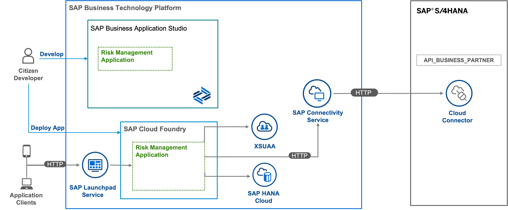

# Accelerate Development of SAP S/4 HANA Extension Applications with SAP Business Application Studio

> Note: The content of this GitHub repository has been created as source for the SAP Discovery Center Mission [Accelerate Development of SAP S/4HANA Extension Applications with SAP Business Application Studio](https://discovery-center.cloud.sap/protected/index.html#/missiondetail/3784/3825/). So we recommend using directly the mission in the SAP Discovery Center.

## Description

The main intend of this scenario is to build a low-code application to display Business Partner data from an SAP S/4HANA on-premise system.

This application showcases:
- Building application on SAP Business Technology Platform (SAP BTP) using SAP Business Application Studio visual tools
- Deploying the application on SAP BTP Cloud Foundry environment
- Connectivity to SAP S/4HANA using SAP Connectivity service

## Business Scenario

In this mission, a *Food Delivery Platform* works with several *Vendors* to deliver food to their customers. For each *Vendor*, the risk is calculated depending on various aspects, for example, their solvency. A *Risk Manager* is responsible for the risk assessment and mitigation.

The *Food Delivery Platform* implements the application as an SAP S/4HANA extension on SAP BTP. This application is developed with the help of the visual tools of SAP Business Application Studio.

## Solution Architecture

The Risk Management application is developed using the SAP Business Application Studio visual tools and runs on the SAP BTP, Cloud Foundry environment. It consumes platform services like SAP HANA Cloud, SAP Build Work Zone, standard edition service and Connectivity. The Business Partner Validation Application uses SAP S/4HANA OData API's to read additional Business Partner Data from the SAP S/4HANA system. The application is then displayed using the SAP Build Work Zone, standard edition service.

## Requirements

You can find all requirements to execute the tutorial in this [section](/documentation/prepare/prerequisites).

## Tutorial using SAP BTP and Mock Server

### Step 1: [Develop Risk Management Application Using SAP Business Application Studio Visual Tools](/documentation/develop/develop-application/)

### Step 2: [Create User Interface and User Roles](/documentation/develop/create-user-interface/)

### Step 3: [Test Application with Sample Data](/documentation/develop/test-application/)

### Step 4: [Implement Custom Logic](/documentation/develop/implement-custom-logic) 

### Step 5: [Consume External Service from SAP S/4HANA](/documentation/develop/consume-external-service)

<!-- ### Step 6: [Deploy Application to Cloud Foundry Environment](/documentation/develop/deploy-application/)

### Step 7: [Integrate the Application with SAP Build Work Zone, standard edition](/documentation/develop/integrate-with-workzone/)

### Step 8: [Optional: Create Continuous Integration and Delivery Job](/documentation/develop/create-cicd-job/) -->

## Known Issues

The tutorial is provided on the "as-is" basis. Currently, there are no known issues for the tutorial project.

## How to Obtain Support
- Check if you find a solution in the [troubleshooting guide.](/documentation/complete/troubleshooting/)
- Create an issue to get support or to report a bug in [GitHub](https://github.com/SAP-samples/btp-bas-risk-management/issues).

## License

Copyright (c) 2022 SAP SE or an SAP affiliate company. All rights reserved. This file is licensed under the Apache Software License, version 2.0 except as noted otherwise in the [LICENSE](LICENSES/Apache-2.0.txt) file.
