# Configure Your SAP BTP Environment with the Help of Boosters

## Introduction

In this section you will configure an SAP BTP account with all the required entitlements, to develop your low-code application using [Boosters](https://help.sap.com/docs/BTP/65de2977205c403bbc107264b8eccf4b/fb1b56148f834749a2bf51127421610b.html?locale=en-US). You also will create an SAP HANA Cloud instance to store the data needed for your application.

 

### Prepare Your SAP BTP Account

1. In [SAP BTP Cockpit](https://account.hana.ondemand.com/), open your global account and navigate to **Boosters**.

2. Search for *Prepare an Account for Developing Extension Applications*.

> This booster will guide you through the process of enabling the tools, configuring entitlements, and assigning members on your SAP BTP account. You will create an account with entitlements for the SAP Business Application Studio, Cloud Foundry Runtime, SAP HANA service and Launchpad service.

3. Choose **Start** to create a **Subaccount**.

   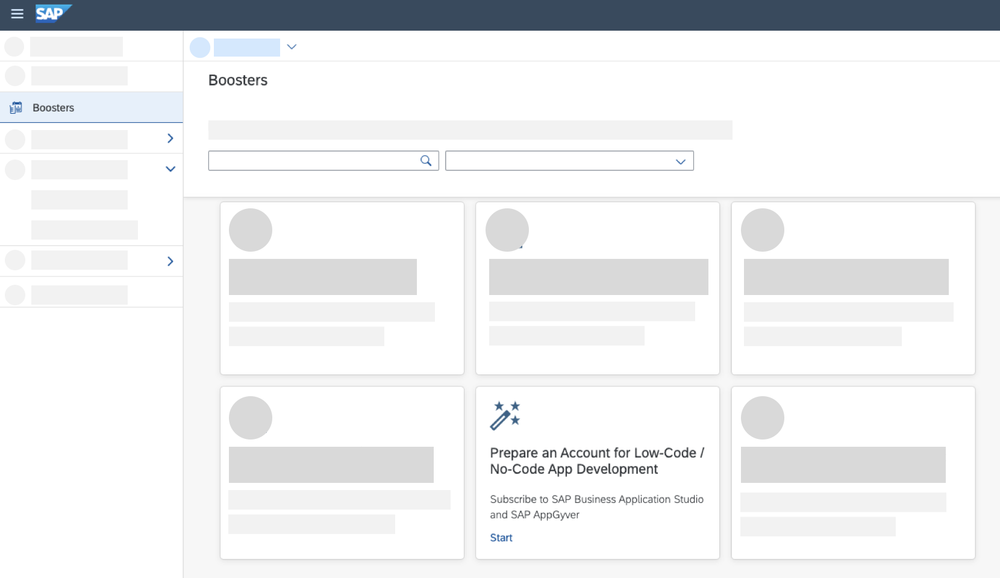

> [Subaccounts](https://help.sap.com/docs/BTP/65de2977205c403bbc107264b8eccf4b/8ed4a705efa0431b910056c0acdbf377.html?locale=en-US#subaccounts) let you structure a global account according to your organization’s and project’s requirements with regard to members, authorizations, and [entitlements](https://help.sap.com/docs/BTP/65de2977205c403bbc107264b8eccf4b/00aa2c23479d42568b18882b1ca90d79.html?locale=en-US#entitlements).

4. In the pop-up a check is running to verify that your account fulfills all the necessary requirements. After all checks are successful, choose **Next**.

   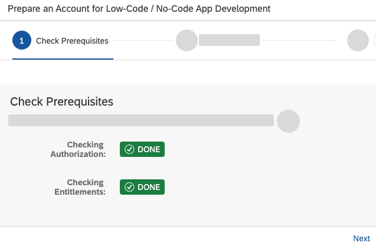

5. In the scenario tab, choose **Create Subaccount** and **Next**.

   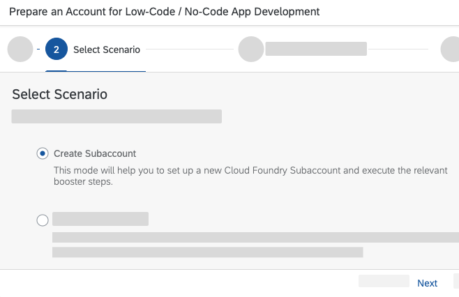

6. (Optional) You can now configure your subaccount to your use case. To save costs, it is recommended to remove the Entitlements for services, which are not needed in this scenario. Find the entitlements for _Application Autoscaler_, _Application Logging service_, and _Continuous Integration & Delivery_ in the table, and delete them by clicking the **bin icon**.

    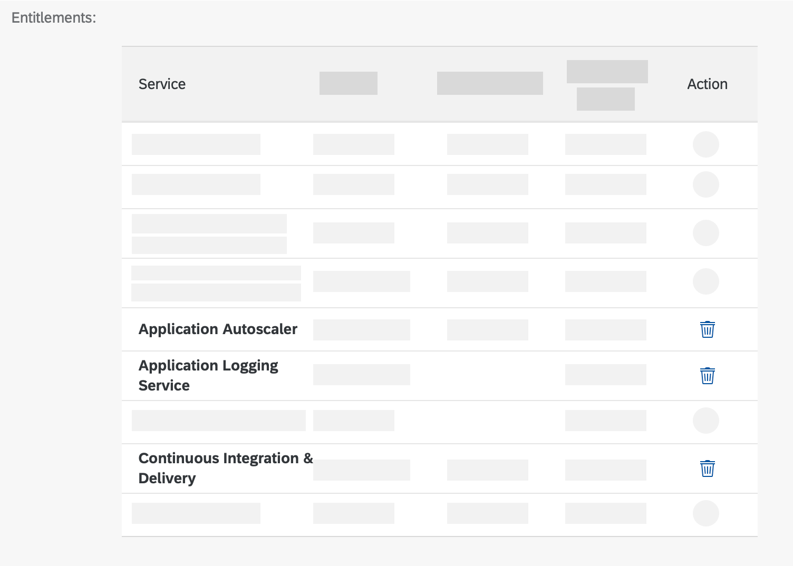

7. Then enter the required information for your subaccount configuration and finish by choosing **Next**:
  - **Subaccount Name:** for example, _Riskmanagement_
  - **Provider:** Amazon Web Services (AWS)
  - **Region:** EU10
  - **Subdomain:** for example, _Riskmanagement_
  - **Org Name:** for example, _Riskmanagement_
  - **Space Name:** for example, _dev_

    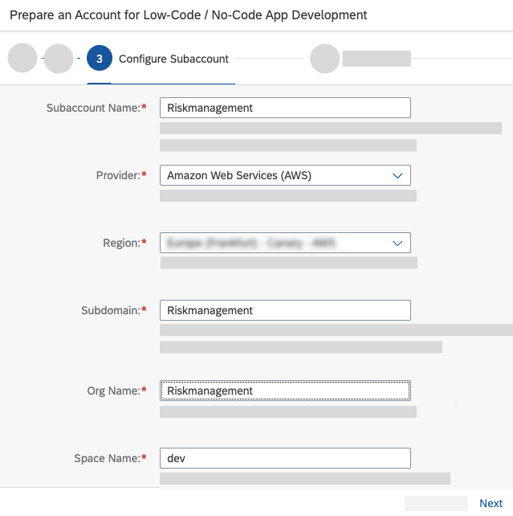

8. You can add users to your account. Enter all required administrators and users e-mail addresses in the input field. In case you have multiple people you can separate e-mails with quotation marks. Choose **Next** to finish.

9. In the next tab, review all the details and then choose **Finish** to start the account creation.

10. After your account is created, open your created **Subaccount** and choose **Entitlements** on the left to add more services to your account.

12. Choose **Configure Entitlements** and choose **Add Service Plans**.

    

12. In the pop-up, use the search function to find required entitlements for **SAP HANA Cloud** and then choose the service plan 'hana' on the left site.

13. Choose **Add 1 Service Plans**.

    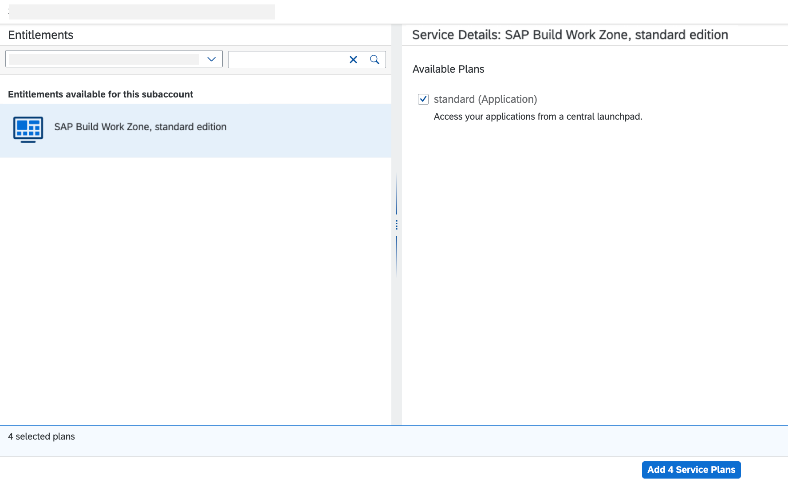

14. Choose **Save** to finish the configuration.

    

15. In the menu on the left, choose **Service Marketplace** and search for **Launchpad Service**.

16. Choose **Launchpad Service** tile.

    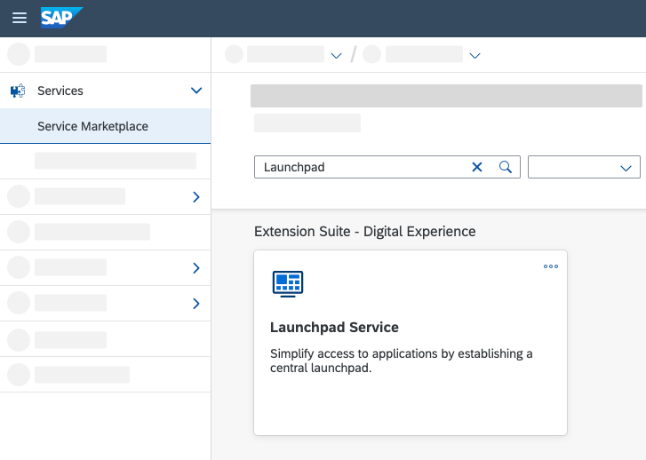

17. In the menu appeared on the right side of your screen, choose **Create** and confirm creation in the pop-up screen.

    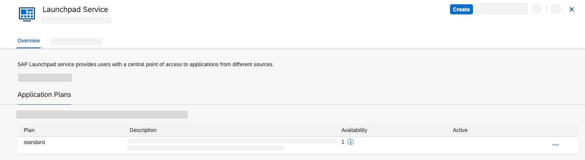

18. In the menu on the left, navigate to **Security** &rarr; **Role Collections**.

     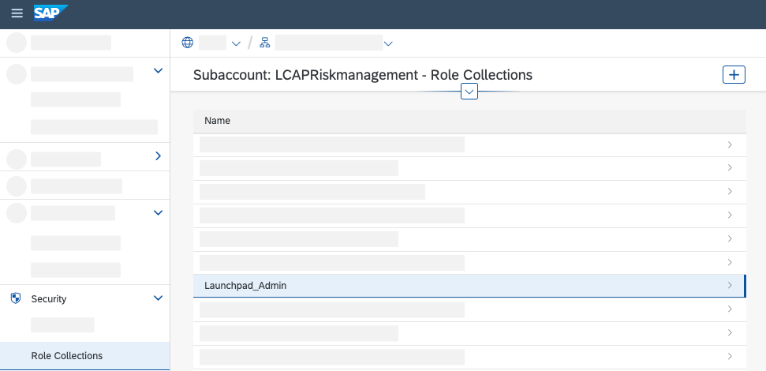

19. In the role collection list, find _Launchpad_Admin_ and choose it to open.

20. Choose **Edit** button and scroll down to **User** section. Enter your e-mail address in the section and select _Default Identity Provider_ as **Identity Provider**.

21. Choose **Save**.

    

 ### Create SAP HANA Cloud Instance

 > The SAP HANA Cloud instance is the main cost driver of this scenario. To save costs, it's recommended to create the instance shortly before usage. Note that previewing your application is possible without the created SAP HANA Cloud instance and only needed for final deployment of your application.

Now, you need to create an [SAP HANA Cloud](https://help.sap.com/docs/HANA_CLOUD/f4997718ff9d45f49f90f5d01d16d5a0/2f0c5e3dc11d4eb8a1d6cb878a311f43.html?locale=en-US) instance.

1. Navigate back to your **Subaccount** and select your **Space**.

2. In the menu on the left choose section **SAP HANA Cloud**, choose **Create**, and choose _SAP HANA Database_ in the dropdown.

   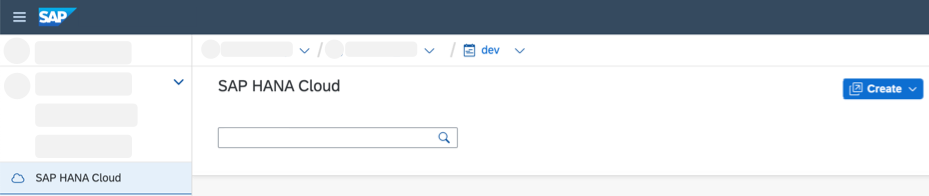

3. Now, you have opened the **SAP HANA Cloud Central** and you can change the **Type** of your instance. Make sure you have selected **SAP HANA Cloud, SAP HANA Database** and choose **Next Step**.

   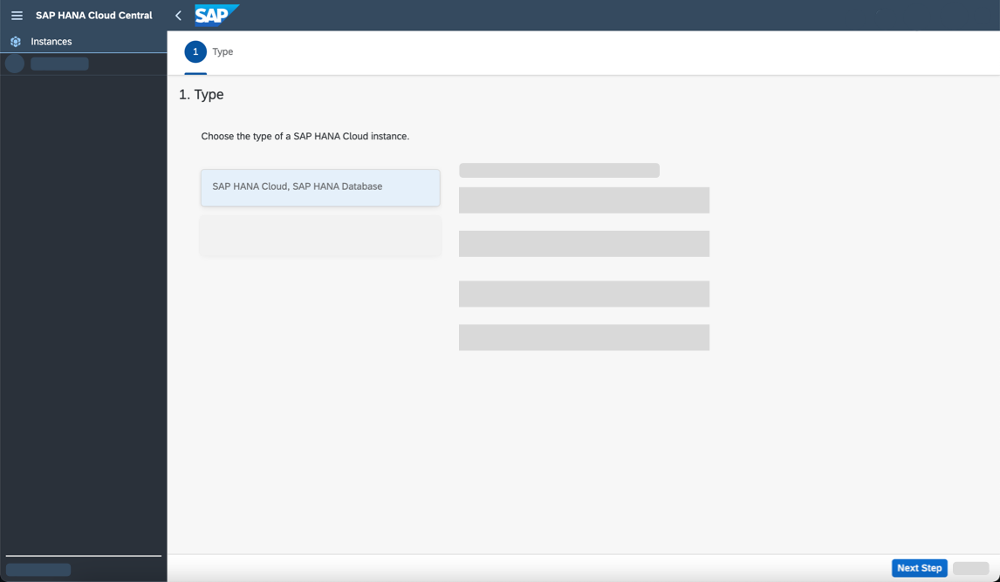

4. Choose a *name* for your instance and choose an Admin Password* and confirm the password in the corresponding field. Choose **Next Step**.

   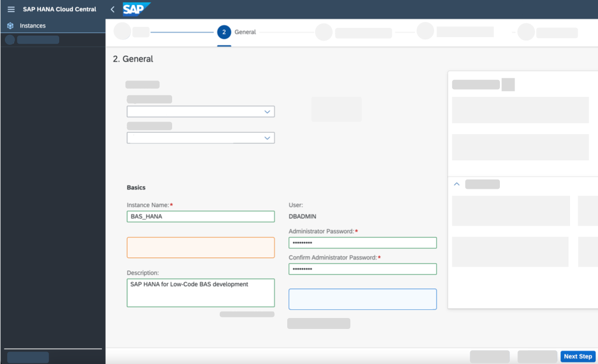

5. In the next tabs "3. SAP HANA Database" and "4. SAP HANA Database availability Zones and Replicas" leave the default configuration and choose **Next Steps**.

6. In tab "5. SAP HANA Database Advanced Settings" scroll down to **Connections** and select **Allow all IP addresses**. Choose **Review and Create**.

    > For demo purposes, we allow all IP addresses in this mission. If you are implementing this scenario in a productive environment, only allow specific IP addresses.

    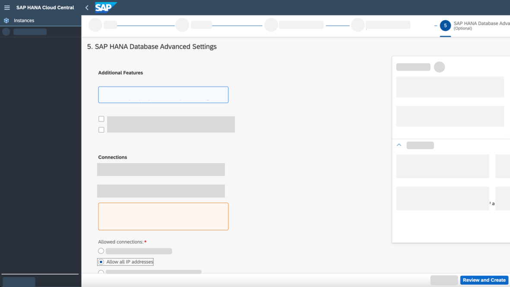

7. Your SAP HANA instance is now being created.

## Summary

You now have prepared your SAP BTP environment, configured your entitlements, and configured your account for the scenario. In the next section, you will use SAP Business Application Studio to develop your low-code application.

Need help? Look at the [Troubleshooting Guide](../../complete/troubleshooting#configure-your-sap-btp-environment-with-the-help-of-boosters) or use mission support to connect with mission experts.
