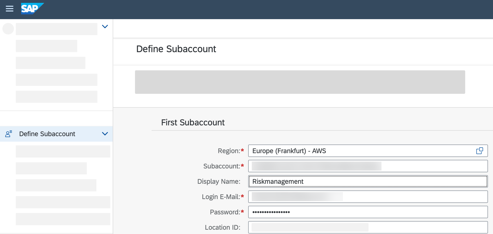
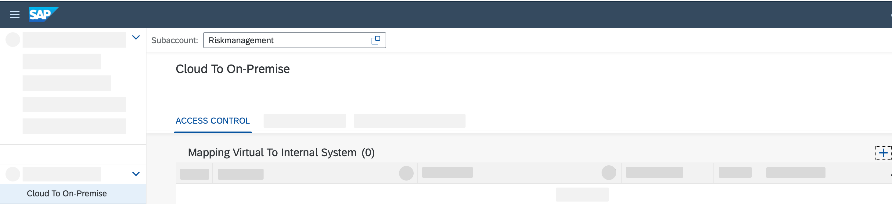
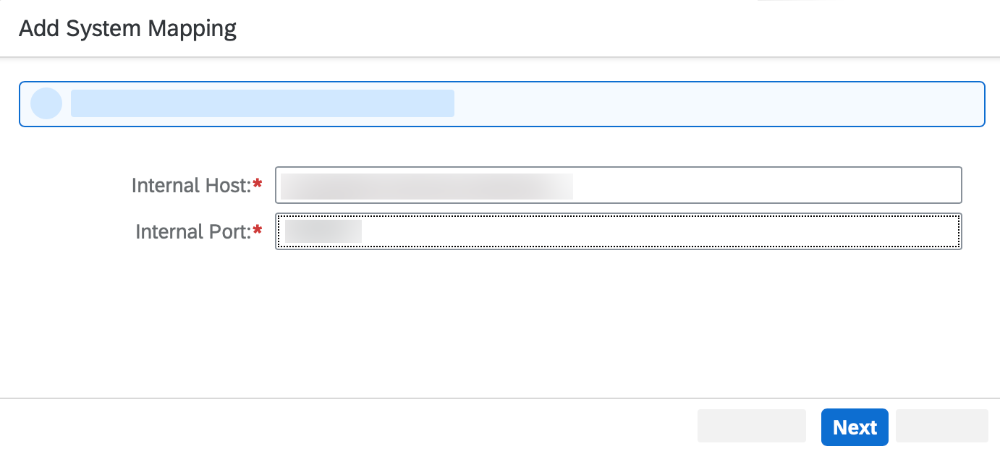
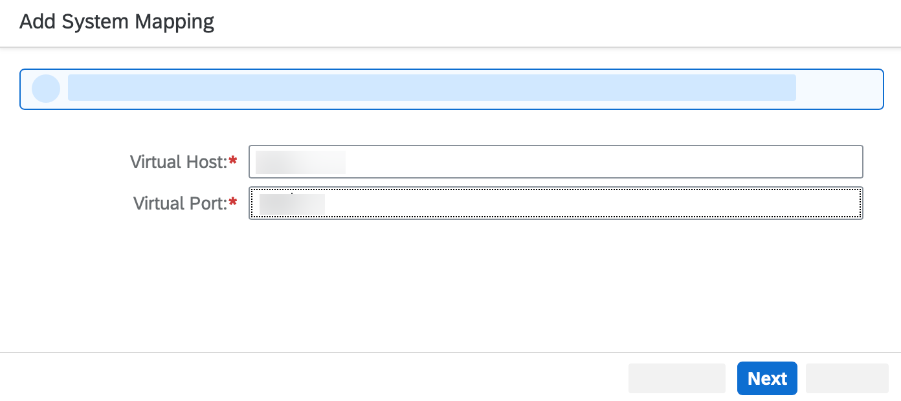
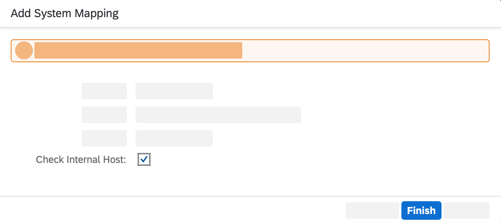
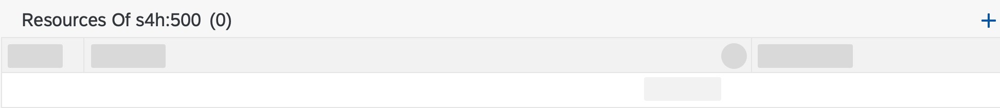
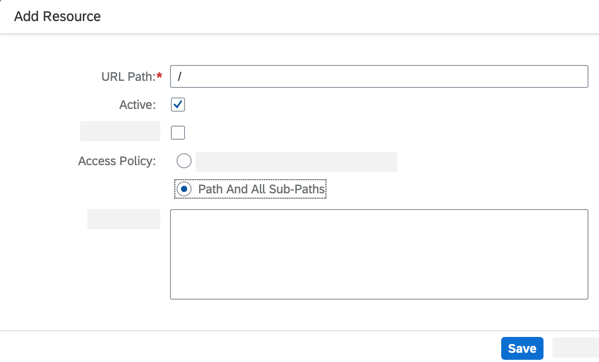
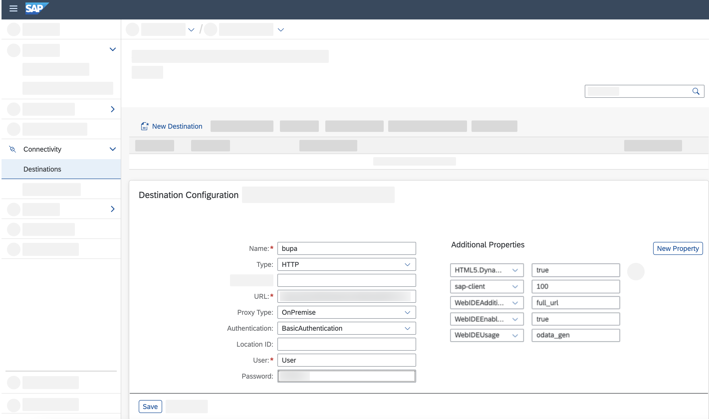
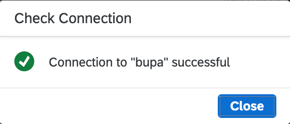

# Configure Systems in Cloud Connector

## Introduction

In this section, you will use SAP Connectivity service to establish a connection between your created cloud application and the SAP S/4HANA backend system. First you will create a system mapping in [Cloud Connector](https://help.sap.com/docs/CP_CONNECTIVITY/cca91383641e40ffbe03bdc78f00f681/e6c7616abb5710148cfcf3e75d96d596.html?locale=en-US), then you will use SAP Destination service to retrieve technical information about destinations that are required to consume the SAP Connectivity service.

 

### Configure Systems in Cloud Connector for Access with Technical User

1. Open your Cloud Connector administration UI for the SAP S/4HANA on-premise system: https://localhost:8443/

   > Adjust the port if you specified another one during the installation. Potentially, you have to use the external IP of your system.

2. Enter **User Name** and **Password**.

3. Choose **Login**.

   > You can find detail information on installing the Cloud Connector in your system landscape in this [tutorial](https://developers.sap.com/tutorials/btp-app-ext-service-cloud-connector.html).

4. Choose **Add Subaccount**.

5. Enter the following data and choose **Save**:
   - Region
   - Subaccount ID
   - Display Name
   - Subaccount User
   - Password

        

    > You can look up the required data in [SAP BTP Cockpit](https://account.hana.ondemand.com/).

6. Navigate to **Cloud to On-Premise**.

7. To add a new system mapping, choose the '+' icon on the right site of the screen.

   

8. In the pop-up window, select _ABAP System_ as a **Backend Type** and then choose **Next**.

9. Select _HTTP_ as a **Protocol** and then choose **Next**,

10. Enter your values for the fields: **Internal Host** and **Internal Port** then choose **Next**.

    

    > - Internal Host: This is the internal IP of your SAP S/4HANA system.
        > - Internal Port: This is set to `50000` for HTTP. However, you can look up the specific HTTP port on your SAP S/4HANA system using the transaction `SMICM`.

11. Enter your values for the fields: **Virtual Host** and **Virtual Port** then choose **Next**.

    

12.	Choose **Principal Type** _None_ and choose **Next**.

13.	Select **Host in header** _Use Virtual Host_ and choose **Next**.

14.	Add a **Description** for your system mapping.

15.	Make sure all the values are correct in the summary and don´t forget to check the Internal Host checkmark.

16.	Choose **Finish**.

    

17.	Choose the **&#x2B;** icon to add a resource.

    

18.	Enter the following data:
    - URL Path: "/"
    - Check **Path and all subpaths**
    - Description

    > For demo purposes, we allow all IP addresses in this mission. If you are implementing this scenario in a productive environment, only allow specific IP addresses.

19. Choose **Save**.

    

### Set Up Destination in SAP BTP Account

> See [SAP Help Portal](https://help.sap.com/viewer/6d3eac5a9e3144a7b43932a1078c7628/Cloud/en-US/0a2e5a45d5494ec08318ead2019d54db.html) for more details on how to set up a destination.

1. Go back to [SAP BTP Cockpit](https://account.hana.ondemand.com/) and select your **Subaccount**.

2. In the menu on the left, find the section **Connectivity** and choose **Destinations**.

3. Choose **New Destination** and enter the required data:
    - **Name:** for example, bupa
    - **Type:** HTTP
    - URL: http://&lt;virtual host>:&lt;virtual port>/sap/opu/odata/sap/API_BUSINESS_PARTNER
    - **Proxy Type:** _OnPremise_
    - **Authentication:** _Basic Authentication_
    - Optional: **Location ID:** "" (only needed if you connect more than one cloud connector to your account)
    - **User:** _Enter Technical User_
    - **Password:** _Enter provided password_

4. Choose **New Property** and enter the following properties:

      | Key        | Value       |
      | ----------- | ----------- |
      | sap-client     | 100  (sap client can vary depending on your backend system)   |
      | HTML5.DynamicDestination     | true       |
      | WebIDEAdditionalData | full_url       |
      | WebIDEEnabled      | true      |
      | WebIDEUsage     | odata_gen       |

5. Choose **Save**.

    

6. Choose **Check Connection**.

    

## Summary

In this section, you have configured the Cloud Connector for connecting the SAP S/4HANA on-premise backend system with SAP BTP.

In the next section, you will add an API to your application to use the established connection to the backend system.

Need help? Look at the [Troubleshooting Guide](../../complete/troubleshooting#cloud-connector) or use mission support to connect with mission experts.
