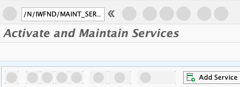
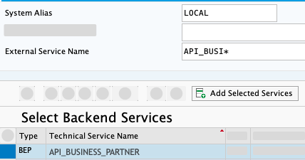
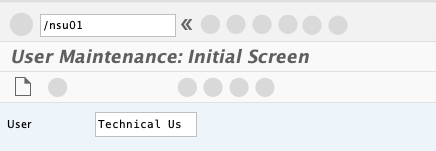
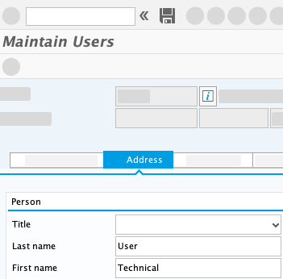
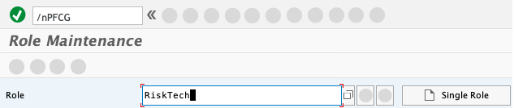
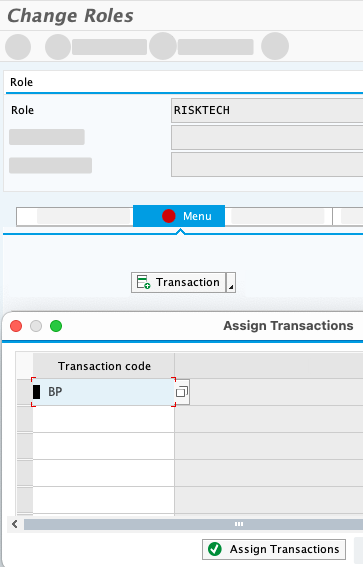
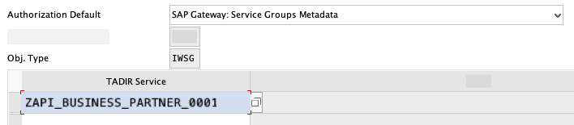
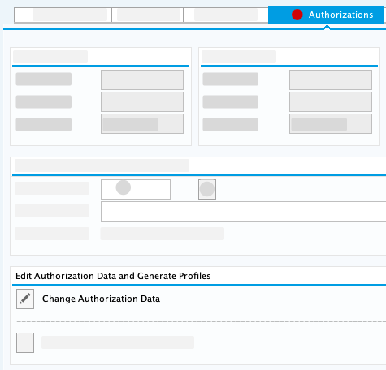
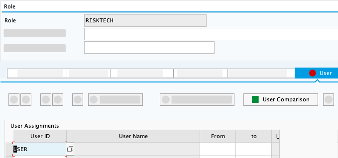

# Configure Your SAP S/4HANA System

## Introduction

To be able to access data in SAP BTP application from SAP S/4HANA system, you will activate the OData endpoint in your system. Next you will create yourself a user in SAP S/4HANA and assigne the needed authorization to allow the usage of your created OData endpoint.

 

### Activate OData Service in SAP S/4HANA On-Premise Backend System

First, we need to activate the OData endpoint in SAP S/4HANA on-premise system, so it is accessible from SAP BTP application.

1.	Open your SAP S/4HANA on-premise system.

2.	Navigate to transaction code: **/N/IWFND/MAINT_SERVICE**.

3.	Choose **Add Service** in the Service Catalog.

    

4.	Enter **System Alias** 'LOCAL', **External Service Name** 'API_BUSINESS_PARTNER' and hit <kbd>Enter</kbd> to search for all matching services.

5.	Choose the checkbox to select service and choose **Add Selected Services**.

    

6.	On the next screen, specify **Package Assignment**, for example, $TMP by choosing **Local Object**.

7.	Check checkbox for **Enable OAuth for Service** and choose **Continue**.

### Create Technical User and Assign Role

Now, we are going to create a user in our SAP S/4HANA backend system and assign the required authorizations.

1.	Go back to your initial screen and navigate to transaction code: **/NSU01**

2.	Enter your Technical User in the field **User**.

    

3.	Choose **Create**.

4.	Switch to the **Address Tab** and add the corresponding last name to the lastname field.

    

5.	In tab Logon Data change **User Type** to **Dialog**.

6.	Create a new **Password** for your User and repeat it to verify. Choose **Save**.

7.	Navigate to transaction code: **/nPFCG**

8.	Enter _RiskTech_ in the ***Role*** field, then choose *Single Role*.

    

9.	On the next screen enter a description first, then switch to the ***Menu*** tab and choose **Save** in the pop-up window.

10. Choose **Transaction** on the menu tab to enter a new Transaction.

11. Enter the transaction code for which you need to provide access in the pop-up window. In our case enter _BP_.

12. Choose *Assign Transactions* to finish.

    

13. Select _Authorization Default_ from the **Transaction** dropdown in the menu tab.

    

14. In the pop-up window, select _SAP Gateway: Service Groups Metadata_ as **Authorization Default** from the dropdown menu

15. Enter the name of active Business Partner API - you can look this up using the menu - into to the table and choose **Copy**.

    

16. Switch to the **Authorizations** tab and choose **Change Authorization Data**.

    

17. Don´t forget to **Save** the role first.

18. Navigate to **Edit** &rarr; **Insert Authorizations** &rarr; **From template**.

    

19. Search for _/IWFND/RT_GW_USER_ in the pop-up window and select the checkmark to apply the template.

    

20. Now choose **Status**, then generate with clicking the **circle icon** on the top and **Save** the profile in the pop-up.

21. Go back and switch to the **User** tab and select your **technical user** in the table. **Save** the profile, choose **User Comparison** and choose full comparisons in the pop-up.

     ´

22. Log off from the admin user system by entering the transaction _/nEX_.

23. Log on to the GUI using your newly created Technical User.

## Summary

You have activated your Business Partner OData service and created a technical user in our SAP S/4HANA on-premise backend system.

In the next section you will use the Cloud Connector to create the connection between SAP S/4HANA system and your SAP BTP account.
