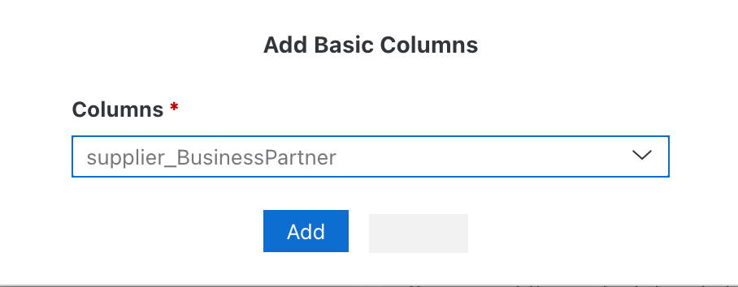
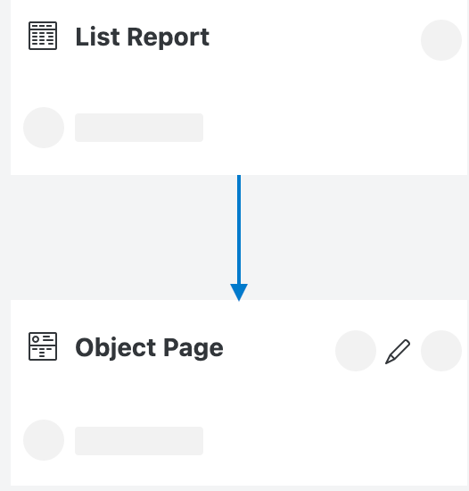
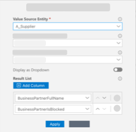

# Consume External Service from SAP S/4HANA

## Introduction

In this section you will expand your application with an API, which allows to get data from your SAP S/4HANA backend system. This enables the application to use data directly out from the backend system. Also you will update the user interface, so the data from backend is displayed correctly in your application.

### Add Business Partner API to Application

1. Open your SAP Business Application Studio and navigate to the **Home**.

2. Find the tile **External Data Model** and choose the **+** icon to create a new data model.

3. On the left side of your screen the menu **Service Center** will appear. Expand the section **SAP System** and find your **Subaccount** there.

4. Then open the destination that you created in section earlier, for example, **bupa**.

5. On the bupa page, choose **A_Business_Partner** in the list **Entity**.

6. Choose **Add Data Model**.

    

7. Go back to the **Home** page and look for the tile **Services**. Choose the **+** icon to add a new entity.

8. In the pop-up enter the following data:
   - **Name:** _A_Supplier_
   - **Type:** _bupa.A_BusinessPartner_
   - **Properties:** _BusinessPartner_, _BusinessPartnerFullName_, _BusinessPartnerIsBlocked_

9. In a next step, we individualize the name of properties. Choose the pencil icon behind your selected property and change the names:
    - _BusinessPartner_ &rarr; _Supplier_
    - _BusinessPartnerFullName_ &rarr; _SupplierFullName_
    - _BusinessPartnerIsBlocked_ &rarr;  _SupplierIsBlocked_

10. Choose **Create**.

   

11. Go back to the **Home** page and find tile **Data Models**. Choose the entry **Risks**.

12. Choose the icon to **Add Relationship** of the risk entity. Click on anywhere on screen to configure relationship.

    

13. In the pop-up configure the relationship like:

    - **Relationship:** _Association_
    - **Relationship Type:** _to-one_
    - **Property Name:** _supplier_
    - **Target Entity Type:** _bupa.A_BusinessPartner_

14. Choose **Create**.

    

### Update UI Components

1. Navigate to the **Home** page of SAP Business Application Studio.

2. Find the tile **User Interfaces** and choose the entry **Risks**.

3. Find the entry **List Report** and choose the icon to edit.

    

4. In the Page Editor, expand the **Columns** section and choose the **+** icon and select ***Add basic columns** from the dropdown.

    

5. In the pop-up, choose **supplier_BusinessPartner** for **Columns**. Then choose **Add**.

    

6. Click on the arrow to navigate back and choose **risks** to open the **Object Page** entry and choose the edit icon.

    

7. In the entry **Section** open **General Information** &rarr; **Form** &rarr; **Fields**. Choose the **+** icon to add new fields to the UI. In the dropdown, select _Add Basic Fields_.

    

8. Add the following fields using the dropdown:
    - _miti_ID_
    - _supplier_BusinessPartner_
    - _SupplierFullName_
    - _SupplierIsBlocked_

9. Choose **Add**.

    

10. Navigate back to the **risks** page and choose **supplier_BusinessPartner**.

11. Find entry **Display Type** and choose **Value Help** in the dropdown.

    

12. In screen **Value Help** choose **Add column** button.

13. In the dropdown, select _SupplierFullName_.

14. Repeat step 12 and 13 with _SupplierIsBlocked_.

15. Choose **Apply**.

    

## Summary

 In this section, you have integrated an external service API from an SAP S/4HANA system to your application. In the next step, you will deploy your application.

Need help? Look at the [Troubleshooting Guide](../../complete/troubleshooting#consume-external-service-from-sap-s4hana) or use mission support to connect with mission experts.
