# Create Continuous Integration and Delivery Job

## Introduction

In this section you will you configure and run predefined continuous integration and delivery (CI/CD) pipelines that automatically build, test, and deploy your code changes to speed up your development and delivery cycles

### Create CI/CD Job

1. In SAP Business Application Studio, find menu on the left and choose CI/CD icon to open CI/CD menu.
2. Choose **Create a Job** to open the *Guided Development* menu

  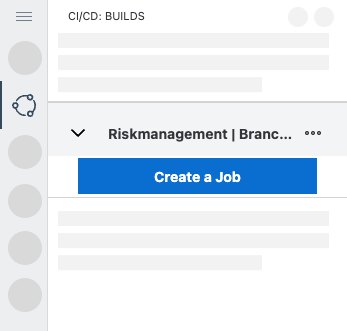

3. In section **Share your Project to Git** and choose **Share project to Git**.

4. Insert your _Git repository URL_ and choose **Enable Sharing**

  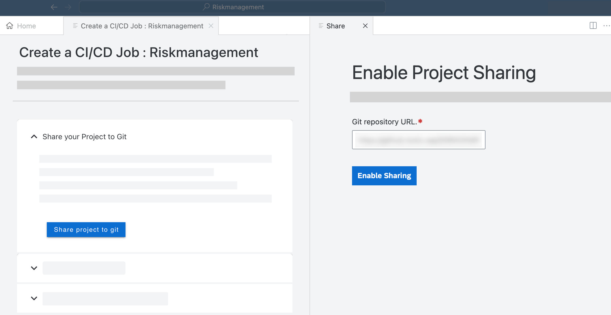
  
5.  In tile *Job Configuration*, choose button **Configure Job**

  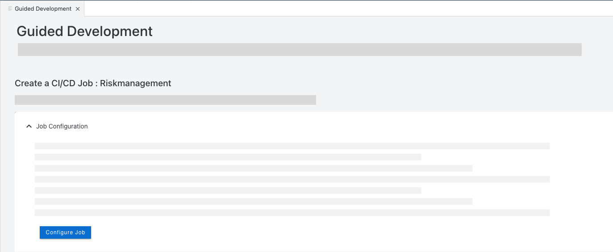
  
6.  Now you can create a new Job. Insert a **Job Name** e.g. 'RMapp' and choose **Continue**

   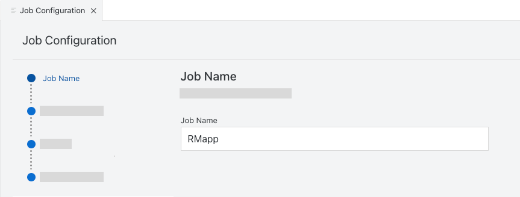
     
7.  In section *Git Credentials* ,configure like described in table and choose **Next**

   | Entry | Value | 
   |---------------|---------------|
   | Git Repositories      | -- Add a Repository - -       | 
   | Repository Name       | e.g. *Riskmanagement*     | 
   | Git Credentials   | -- Add Credentials --      | 
   | Git Credential Name     | e.g. *rmcredential*      |    
   | Git Credential Description  | e.g. *Credential for Riskmanagement app*      |
   | Username  | *Enter your GitHub username*     |   
   | Token \ Password |  *Enter your GitHub Token*     | 
   
   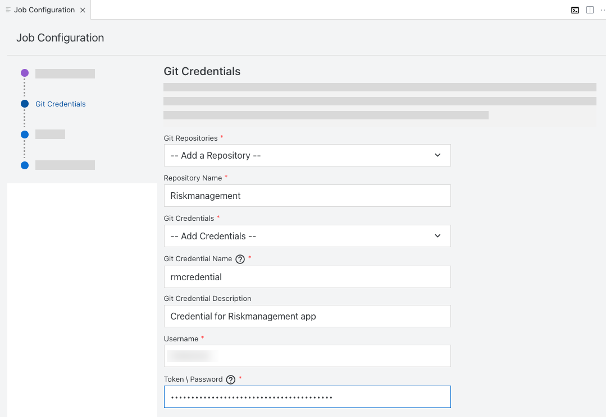
     
 8. In Section *Test*, choose **Yes** to specify the Cloud Foundry space to which the application will be deployed for testing
 9. Configure like described in table and choose **Next**
    
   | Entry| Value | 
   |---------------|---------------|
   | API Endpoint     | select your API Endpoint      | 
   | Org Name      | select your org name     | 
   | Space      | select your dev space   | 
   | Cloud Foundry Credentials     |  -- Add Credentials --      | 
   | Cloud Foundry Credential Name     | e.g. *my-credential*     | 
   | Cloud Foundry Credential Description    | e.g. *My Credential*     | 
   | Username     | *Enter your CF username*      | 
   | Token \ Password    | *Enter your CF token*     | 
   
   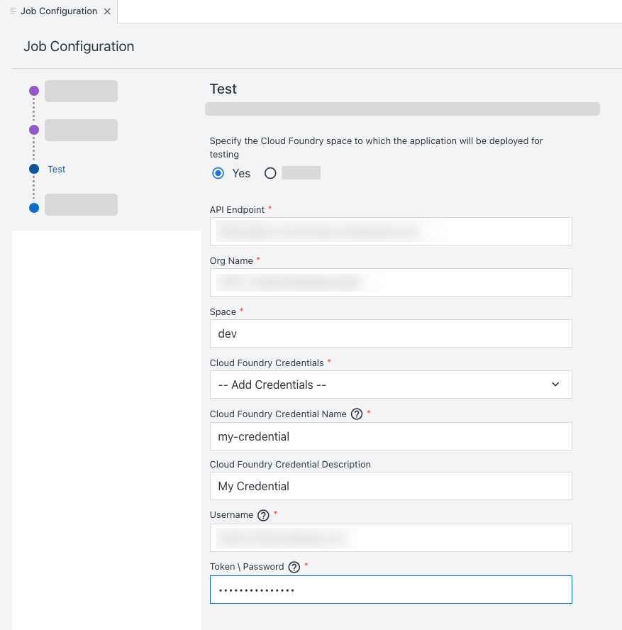
   
 10. Choose **Finish** 
 11. Back in screen *Guided Development* choose **Get Webhook Data**
 12. Find entries for **Payload URL** and **Secret** and copy them into a text editor of your choice to save them for later.
 13. Navigate to the GitHub repository you have added to your account in step 5.
 14. In GitHub, open the **Settings** menu and find **Webhooks** tab
 15. Choose **Add Webhook**
  
  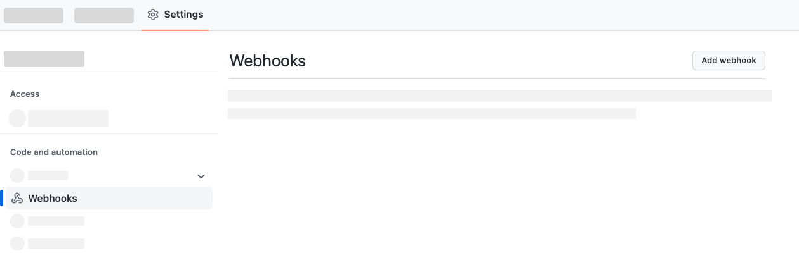
      
 16. In Webhook menu, insert your **Payload URL** which you have copied in step 10.
 17. Choose **Content type** as *application/json*
 18. Insert your **Secret** which you have copied in step 10.
 19. Choose **Add Webhook**
 
  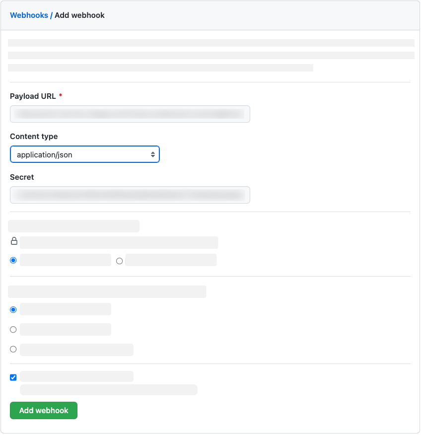
  
 
### Check Application Logs
  
1. Open your **SAP BTP Account** and navigate to your **space**

2. Find your deployed application in the table and choose link to open

 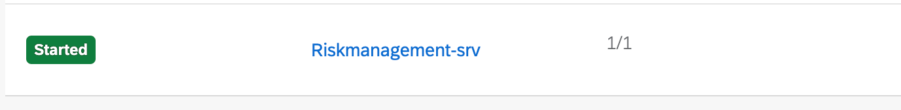

3. Find menu for **Logs** on th left side of your screen and choose **Open Kibana Dashboard**

 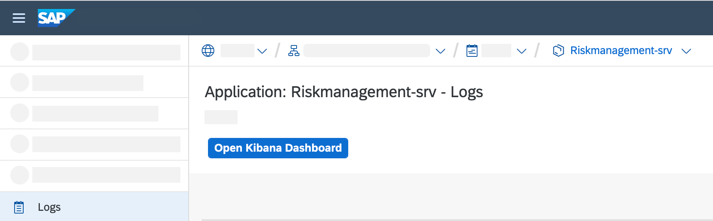

4. In Elastic dashboard, choose **Request and Logs**. Find logs for your application listed in table

 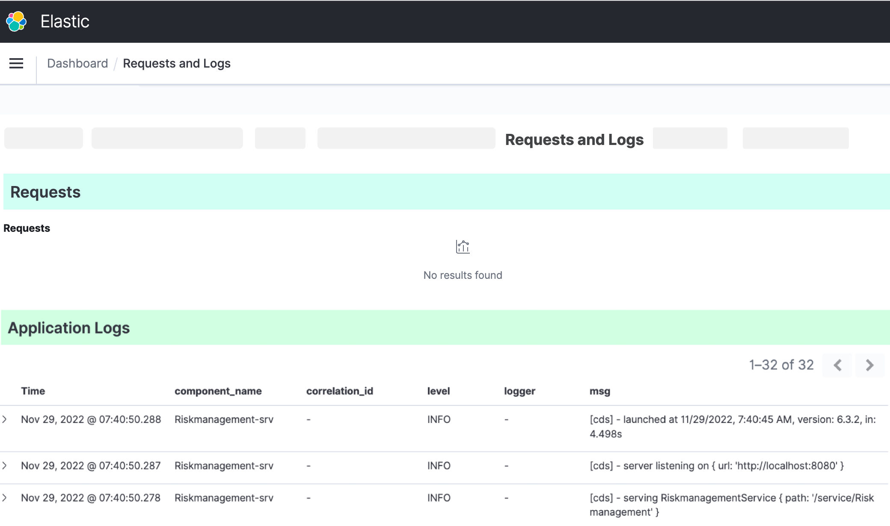
