# Create User Interface and User Roles

## Introduction

In this section you will build a user interface to display the data and add role concept to define different authorizations

 

#### Add User Interface

After defining the foundation of your application in the previous chapter, we will add an SAP Fiori elements based User Interface to the application.

1. Go to the storyboard page and find the **[UI Application](https://help.sap.com/docs/Application%20Development/6a5fc562f6e2402aa84b0416614a05fc/efab3e5b3c6b4647a6928d68372a67ac.html?locale=en-US)** tile and choose the **+** icon to add a new user interface.

   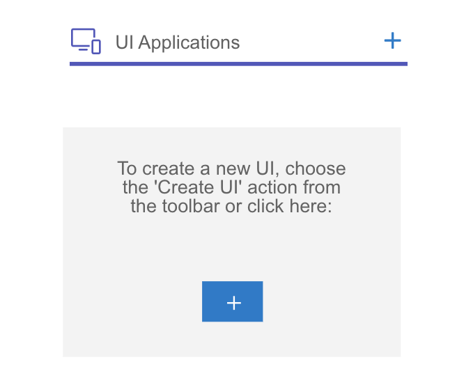

2. A screen will show up where you can add the **Display Name**: _Risks_ and enter a description. Choose **Next**.

   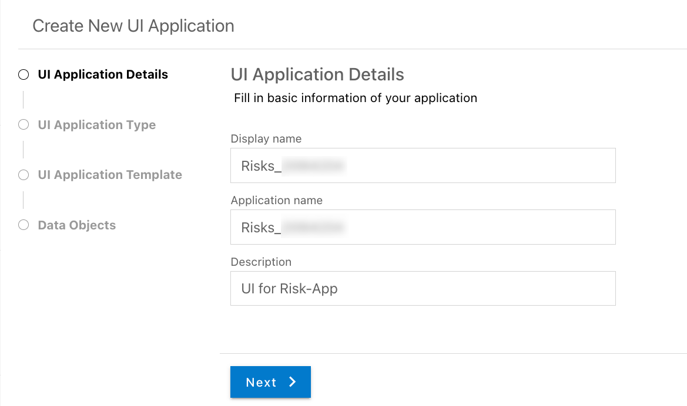

3. Select **UI Application type** as **_Template-Based, Responsive Application_** to create a SAP Fiori elements based UI. Choose **Next**.

   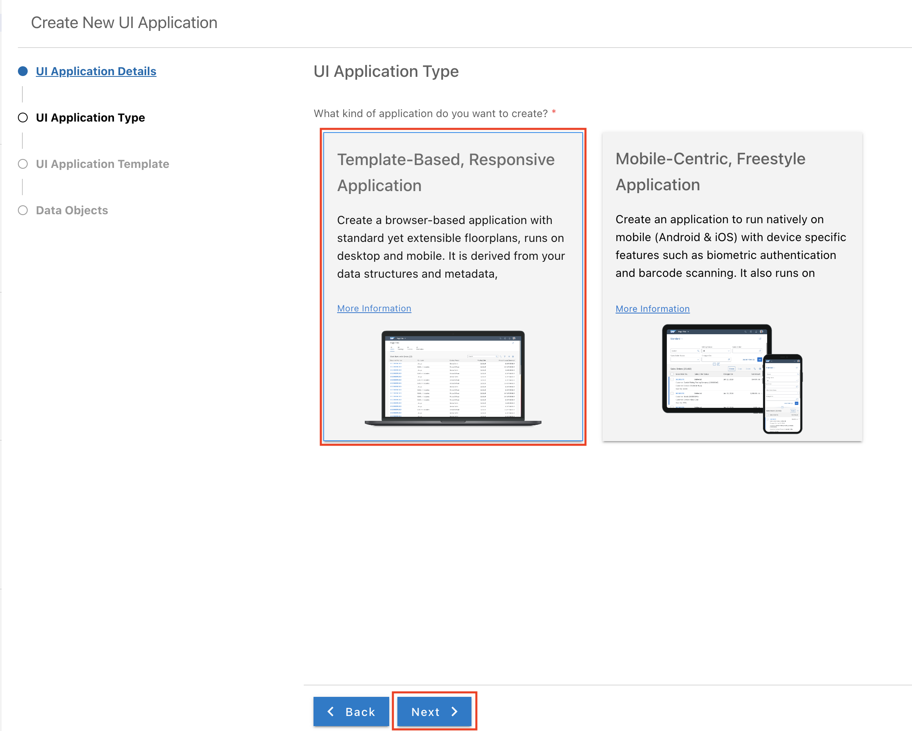

4. Choose **UI application template** as **_List Report Page_**. Choose **Next**.

   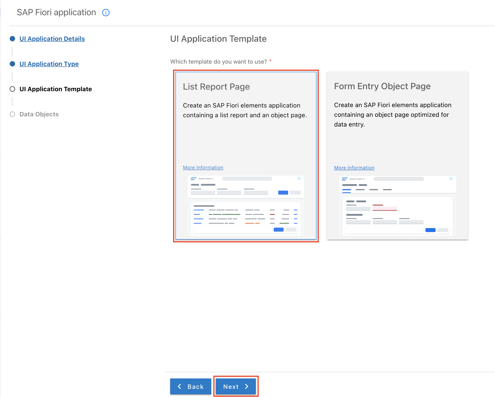

5. Select main entity as _risks_ in Data Objects, to show risks entity in UI. Choose **Finish**.

   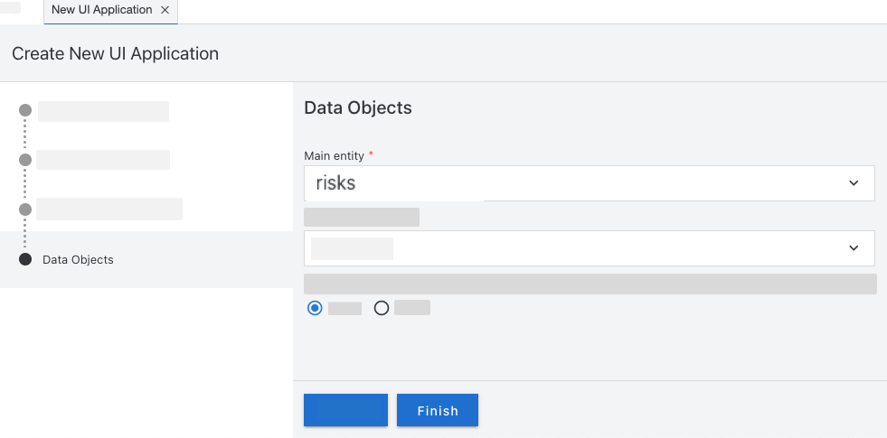

<!-- 6. Repeat the steps 1–4 for **_Mitigations_**. This time choose _Mitigation_ as **Display Name**.

7. Select **Mitigation** as main entity in Data Objects, and choose **_risks_** as navigation entity. Choose **Finish**.

   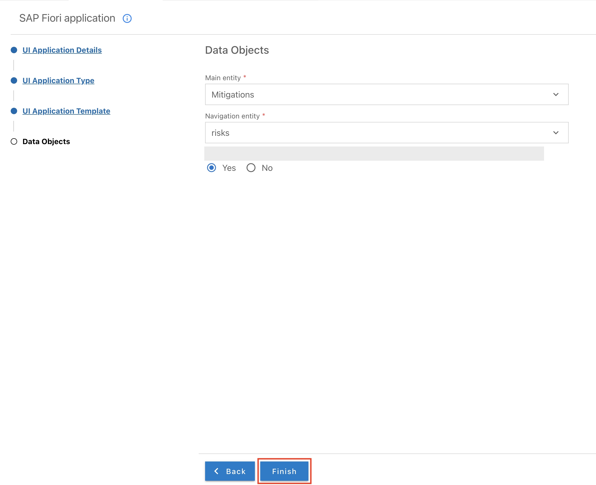

8. Under UI Applications, choose the entry **Riskmanagement.Mitigations**.

   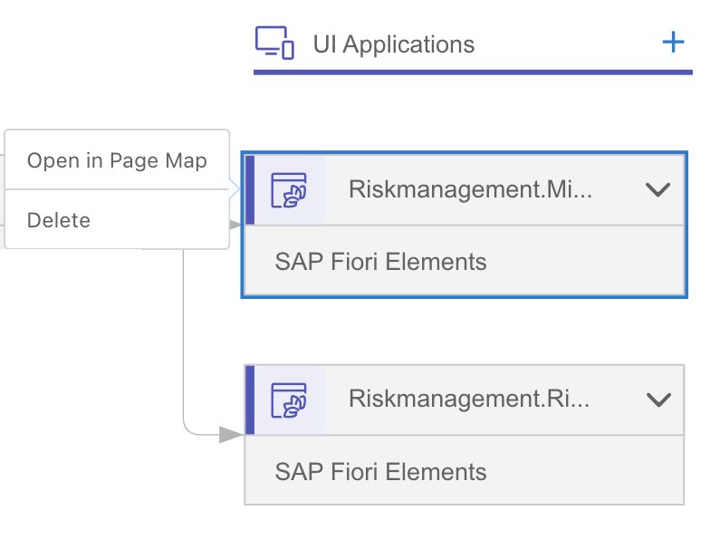

9. Find the **Object Page** entry and choose the edit icon.

    

10. Near to **Sections** choose the **+** icon to add new section to the UI. In the dropdown, select _Add Table Section_.

    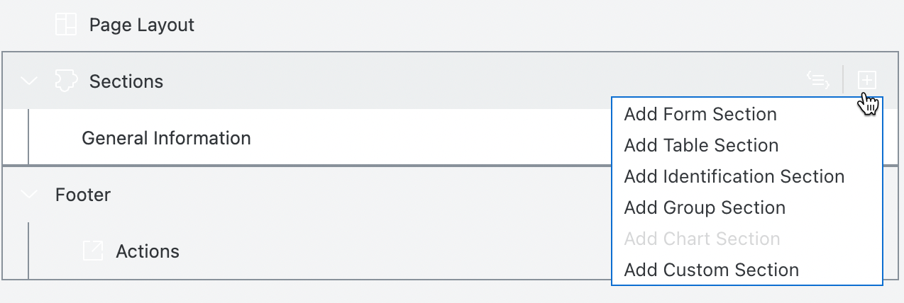

11. In the popup enter Label as **Risks** and choose value source as **risks** from the dropdown.

      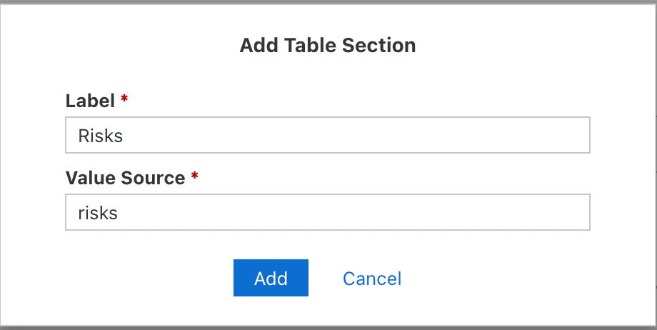

12. Click on **Add** button. -->

6. In the entry **Section** open **Risks** &rarr; **Table** &rarr; **Columns**. Choose the **+** icon to add new fields to the UI. In the dropdown, select _Add Basic Columns_.

      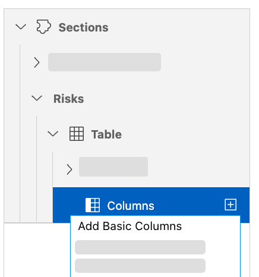

7. In the dropdown choose the following fields inside **risks**.
   - ID
   - title
   - description
   - impact
   - prio

8. Click on **Add** button.

      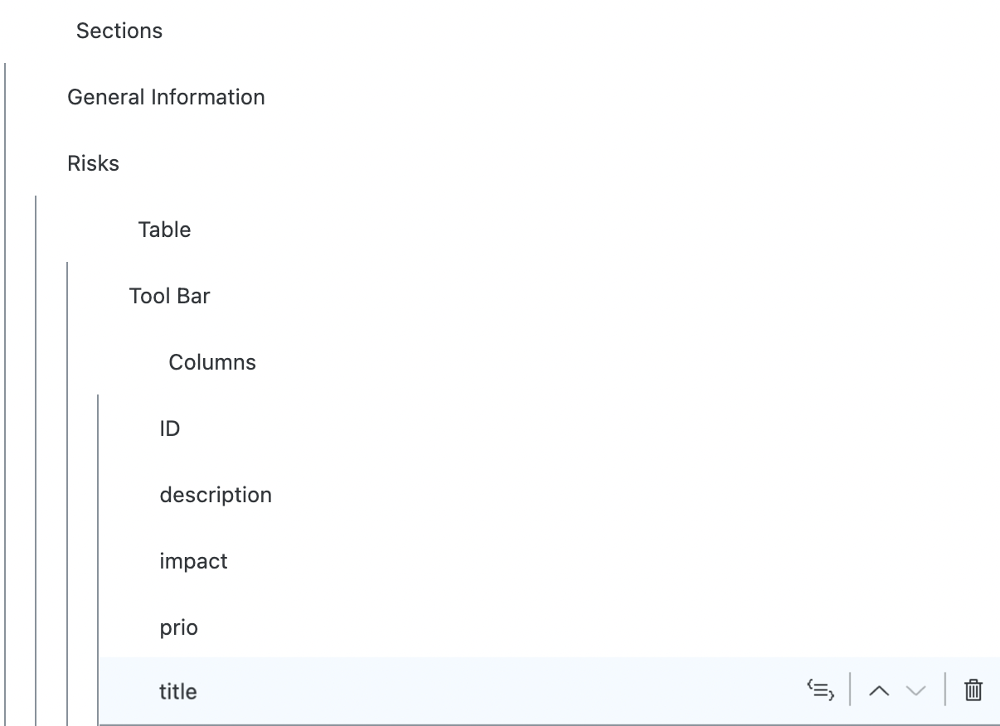

#### Create User Roles

Now, you can create roles to define different authorization for your application. For example you might want to ensure that some people can view data, but are not able to edit them.

1. Go back to the storyboard of the application. Find the **Open Editor** dropdown on the top and choose **[User Roles](https://help.sap.com/docs/Application%20Development/6a5fc562f6e2402aa84b0416614a05fc/369ed9cc7a724cfcb2bdbe20f8b6e7d6.html?locale=en-US)**.

   
   

2. Choose **+** icon and enter a role name, for example, _RiskViewer_. Enter a description and choose **Read** as **Privilege Defaults**. Choose **Save**.

   

3. Choose your created role and select your created service in the **Service Assignments** field.

   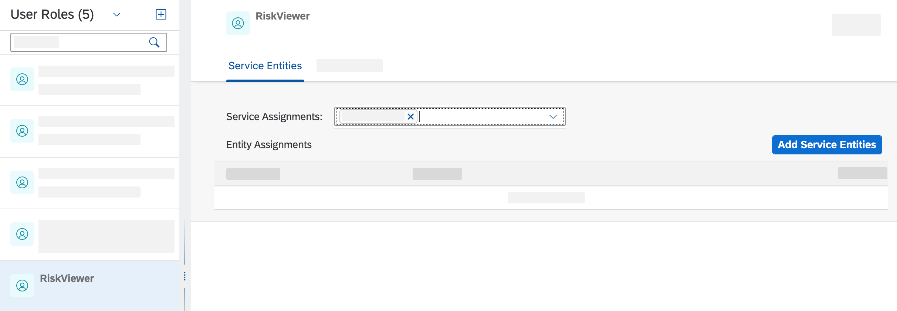

4. Choose **Add Service Entities**. In the pop-up, switch on the assign toggle button for _risks_ and _mitigations_. Check if slider for privileges is selected as read. Choose **Save**.

   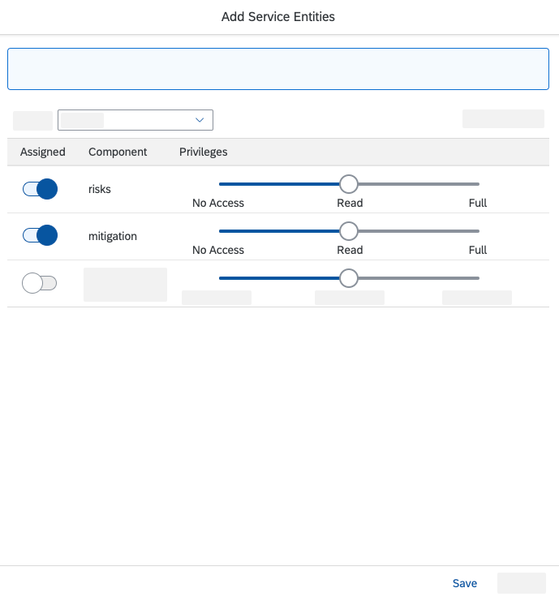

5. Go back to **User Roles** and choose the **+** icon to add a new role. Enter a role name, for example, _RiskManager'_. Enter a description and choose **Full** as Privilege Defaults. Choose **Save**.

   

6. Choose your created role and select your created service in the **Service Assignments** field.

7. Choose **Add Service Entities**. In the pop-up, switch on the assign toggle button for _risks_ and _mitigations_. Check if slider for privileges is selected as full. Choose **Save**.

   

## Summary

You now have developed your first application with SAP Business Application Studio visual tools. In the next section you will test the application.

Need help? Look at the [Troubleshooting Guide](../../complete/troubleshooting#develop-risk-management-application-using-sap-business-application-studio-visual-tools) or use mission support to connect with mission experts.
