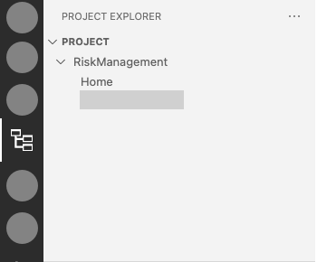
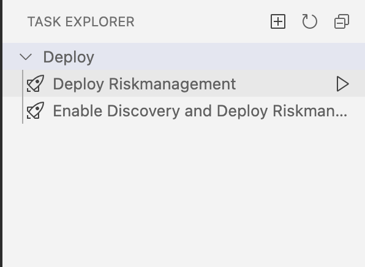
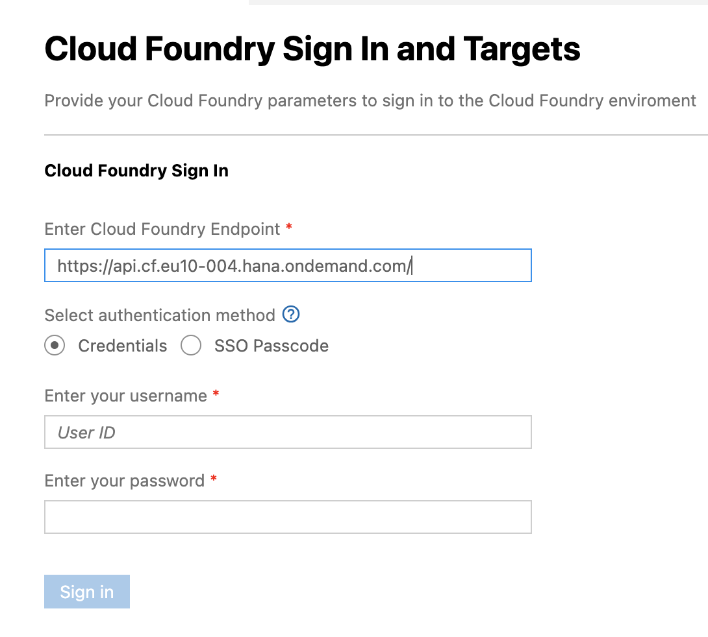
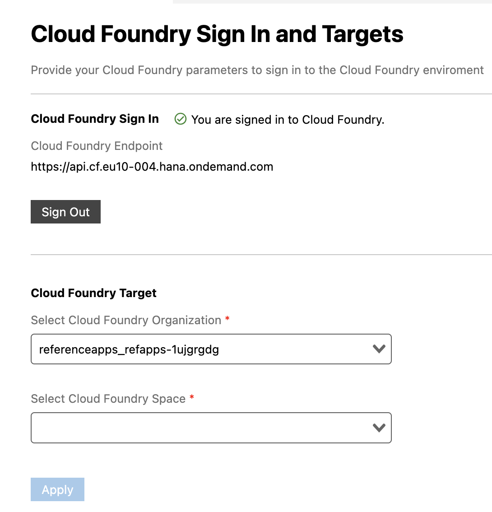
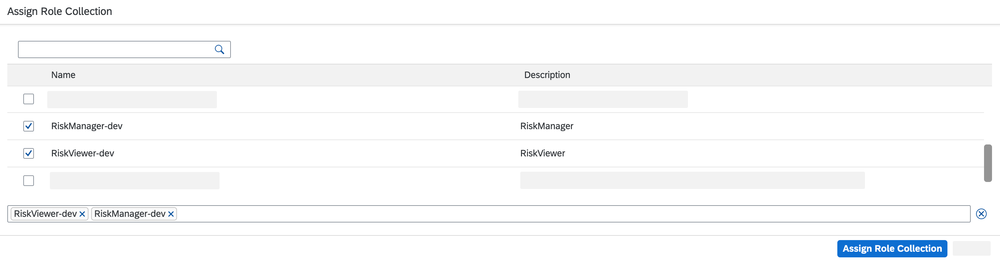

# Deploy Application to Cloud Foundry Environment

## Introduction

In this section, you will deploy the application to Cloud Foundry environment.

 

### Deploy Application to Cloud Foundry

1. Open SAP Business Application Studio.

2. Open the Home view of SAP BAS. Choose **Project Explorer** &rarr; **RiskManagement** &rarr; **Home**

   

3. Find the **Deploy** button in the top right of your screen.

   

4. Log in to your account:
   - Provide API endpoint to your account
   - Select authentication method 'SSO Passcode'
   - Click on the link 'open a new browser page to generate your SSO passcode'
   - Enter SSO passcode 
   - Click on Sign in

   
   
   - Select org and space
   - Click on Apply
   
   

5. Your application will be deployed. This can take a few minutes.

### Assign Role Collection

Before you can use the application, you need to assign yourself to the roles you have created in the section before. This needs to be done so you are able to edit and view the data from the application.

1. Go back to [SAP BTP Cockpit](https://account.hana.ondemand.com/).

2. Navigate to **Security** &rarr; **Users**.

3. Select your username and choose the tree dots.

4. In the dropdown, choose **Assign Role Collections**.

   

5. In the pop-up, find **RiskManager-dev** and **RiskViewer-dev** and select the checkmark to assign roles.

6. Choose **Assign Role Collection**.

   
