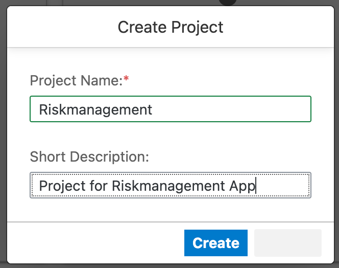
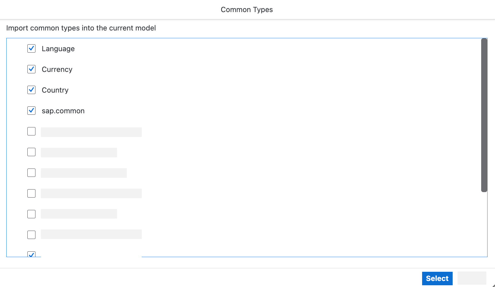
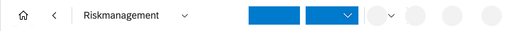

# Develop Risk Management Application Using SAP Business Application Studio Visual Tools

## Introduction

In this section you will first create your development environment in SAP Business Application Studio. Then you will use the created environment to develop the sample application:
- Create data models
- Define relationships between the entities
- Upload test data
- Build a user interface to display the data
- Add role concept to define different authorizations

 

## Develop Risk Management Application

### Open Low-Code Development Tools and Create Development Project

1. Go back to your subaccount in SAP BTP Cockpit and navigate to **Instances and Subscriptions** in the menu on the left side of the screen.

2. Find **SAP Business Application Studio** in the application section and choose the browser icon to open the app.

3. In home page of SAP Business Application Studio choose button **Create Dev Space** to start

   

   > A [dev space](https://help.sap.com/docs/SAP%20Business%20Application%20Studio/9d1db9835307451daa8c930fbd9ab264/6053df8bca3946f098bc9f89e49d7317.html?locale=en-US) in SAP Business Application Studio is a development environment with the tools, capabilities, and resources needed for developing your application.

4. Enter a name for your Dev Space for example, _Riskmanagement_  and select **[Full-Stack Application Using Productivity Tools](https://help.sap.com/docs/SAP%20Business%20Application%20Studio/9d1db9835307451daa8c930fbd9ab264/00ad0484344c461caf80a7c695fd38af.html?locale=en-US)** in menu.

5. Choose **Create Dev Space**

   

6. Your Dev Space is now being created and as soon as status change to _Running_ you can open your Dev Space by clicking on the name

   

7.  In the pop-up enter a **Project Name**, for example, _riskmanagement_ and provide a **Short Description**.

8. Finish by choosing **Create**.

   

   > Loading SAP Business Application Studio for low-code development can take some time, especially if it’s the first time you use it.

9. Once your project is created, you can open the Home view of SAP BAS. Choose **Project Explorer** &rarr; **RiskManagement** &rarr; **Home**

   

#### Start Development of Application and Create Data Model

Now you can start the development of your application. First you will model your application and define the database table and the relationship between the entities.

1. In this application two Data Models 'Risks' and 'Mitigations', to hold the data are needed. To create a Data Model open SAP Business Application Studio under tab **Home**, look for the tile **[Data Models](https://help.sap.com/docs/Application%20Development/6a5fc562f6e2402aa84b0416614a05fc/759ecc54523141d1af2b56f7b27c110a.html?locale=en-US)** and choose the **+** icon to add a new entity.

   

2. Enter the **Entity Name** _Risks_. Retain the property `ID` and choose the **+** icon in the table to add the following properties:

    | Property Name | Property Type | Max Length |
    |---------------|---------------|------------|
    | title         | string        | 100        |
    | prio          | string        | 5          |
    | description   | string        | 100        |
    | impact        | integer       |            |
    | criticality   | integer       |            |

      

3. Choose **Create**.

4. Back in the **Data Model Editor**, choose the **Add Entity** button in the menu on the top to add another entity. Enter the Entity name _Mitigations_. Retain the property `ID` and choose the **+** icon in the table to add following properties:

   | Property Name | Property Type | Max Length |
   |---------------|---------------|------------|
   | description   | string        | 100        |
   | owner         | string        | 100        |
   | timeline      | string        | 100        |

   

   

5. Choose **Create** to finish.

6. Now, you can see two entities in the **Data Model Editor**. In a next step you will describe the interconnection between those entities by defining a relationship, so each risk has a mitigation associated to it.  Find the entry of **Risks** and click on the header of the table. Choose **Add relationship Icon** in the menu appearing on the right. Connect the appeared line to Mitigations entity, by clicking on table and configure the relationship in pop-up.

   

7. In the pop-up screen enter all the required details:
   - Select **Relationship:** _Association_
   - Select **Multiplicity:** _To-one_
   - Enter **Property name:** _miti_

      

8. Choose **Create**.

9. Repeat the previous step for **Mitigations**. Click on the header of the table to **add relationship**. Connect the appeared line to Risks entity, by clicking on table and configure the relationship in pop-up.

10. In the pop-up screen select all the required details:
   - **Relationship:** Association
   - **Multiplicity:** To-many
   - **Property Name:** risks
   - **Backlink Property:** miti

   
      

11. Choose **Create**.

12. Back in the **Data Model Editor**, choose **Import** at the top bar.

13. In the dropdown, select **Common Types** from the list.

    

   `sap.common` provides predefined easy-to-use `Types`, `Aspects` and `Code Lists` that can be used in the application to foster interoperability.

14. In the pop-up, select **sap.common** from the list and choose **Select** to finish.

    

15. Go Back in the **Data Model Editor** by clicking on **home icon**

      

16. Click on the header of the **Risks** entry and then choose the **Include Aspects** icon in the appeared menu. This allows to flexibly extend definitions by new elements as well as overriding properties and annotations.

    

17. In the pop-up, choose **global.managed** from the list

    

18. Choose **Select**. The global.managed aspect allows to track changes made in the data.

19. Repeat the steps for _Mitigations_. Click on the header of the **Mitigations** entry and choose the **Include Aspects** icon in the appeared menu.

20. In the pop-up, choose **global.managed** from the list and choose **Select**.

      

#### Create Services

Now you will create service entities for Risks and Mitigations to define which parts of the data models you just have created should be exposed to the application.

1. Go back to the home page of the application. Find the **[Services](https://help.sap.com/docs/Application%20Development/6a5fc562f6e2402aa84b0416614a05fc/af4df4c8fcd94152bb7bf6a4e205709b.html?locale=en-US)** tile and choose the **+** icon to add a new service entity.

   

2. On the next screen, enter the following and choose **Create** to finish:
   - Enter **Name:** _risks_
   - Select **Namespace:** "riskmanagementService"
   - Select **Type:** "riskmanagement.Risks"

   

3. In the screen **Service Editor**, find the risks entity and choose header of entry. A menu will appear on the right side of the screen. in section **Property Sheet** check the checkbox for _draft editing_.

   

   `Draft Editing` allows to create new data for `Risks` in the draft mode with pre-defined handlers.

4. Back in **Service Editor** choose **Add Entity**. Repeat the previous steps and configure the new entity and choose **Create** to finish:
   - Enter **Name:** _mitigation_
   - Select **Namespace:** "riskmanagementService"
   - Select **Type:** "riskmanagement.Mitigations"

     

5. Find the Mitigations entity and choose header of entry. A menu will appear on the right side of the screen. In section **Property Sheet**, check the checkbox for _draft editing_.

#### Add Sample Data

Once the structure of your application is finished, you can add sample data to the application. You either can use the visual data editor or insert data using a CSV file.

1. Download the [archive](../../../data.zip) containing the sample data in CSV format and extract the files.

2. Go back to the home page of the application. Find the **[Sample Data](https://help.sap.com/docs/Application%20Development/6a5fc562f6e2402aa84b0416614a05fc/a024e7debfc24b67a0120447b147fab4.html?locale=en-US)** tile and choose **+** icon to add a new data entity.

   

3. In the pop-up choose **Import** and select _Risks_ in the **Import for Entity** field. Then choose **Import**.

   

4. Import `Riskmanagement-Risks.csv` CSV file with the required data for risks.

   

> Hint: SAP Business Application Studio might show an error in this step, which will be fixed while importing the mitigation csv file.

5. Similarly, import `Riskmanagement-Mitigations.csv` CSV file with the required data for mitigations.

## Summary

You now have developed your first application with SAP Business Application Studio visual tools. In the next section you will create user interface and user roles.

Need help? Look at the [Troubleshooting Guide](../../complete/troubleshooting#develop-risk-management-application-using-sap-business-application-studio-visual-tools) or use mission support to connect with mission experts.
