# Develop Risk Management Application Using SAP Business Application Studio Visual Tools

## Introduction

You will now develop the application with SAP Business Application Studio visual tools.

 

## Develop Risk Management Application

### Open Low-Code Development Tools

1. Go back to your subaccount in [SAP BTP Cockpit](https://account.hana.ondemand.com/) and navigate to **Instances and Subscriptions** in the menu on the left side of the screen.

2. Find **SAP AppGyver** in the application section and choose the browser icon to open the app.

   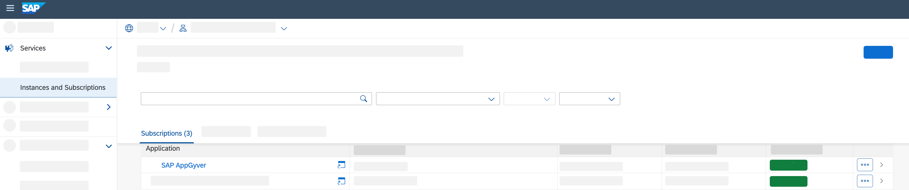

### Create Development Project

Now, you are on the home page of low-code **Application Development**.

1. Start a new **Project** by choosing **Create**.

   

2. Select **Business Application** in the dropdown.

3. In the pop-up enter a **Project Name**, for example, _riskmanagement_ and provide a **Short Description**.

4. Finish by choosing **Create**.

   > SAP Business Application Studio is about to be opened and a dev space is created.

   > Loading SAP Business Application Studio for low-code development can take some time, especially if it’s the first time you use it.

#### Create Data Model

First you will model your application and define the database table and the relationship between the entities.

1. In SAP Business Application Studio under tab **Home**, look for the tile **Data Models** and choose the **+** icon to add a new entity.

   

2. Enter the **Entity Name** _Risks_ and choose the **+** icon in the table to add the following properties:

    | Property Name | Property Type | Max Length |
    |---------------|---------------|------------|
    | title         | string        | 100        |
    | prio          | string        | 5          |
    | descr         | string        | 100        |
    | impact        | integer       |            |
    | criticality   | integer       |            |

3. Choose **Create**.

   

4. Back in the **Data Model Editor**, choose the **+** icon in the menu on the top to **add** another entity. Enter the Entity name _Mitigations_ and choose the **+** icon in the table to add following properties:

   | Property Name | Property Type | Max Length |
   |---------------|---------------|------------|
   | description   | string        |            |
   | owner         | string        |            |
   | timeline      | string        |            |

   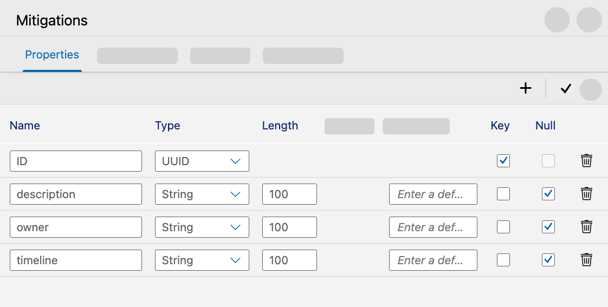

   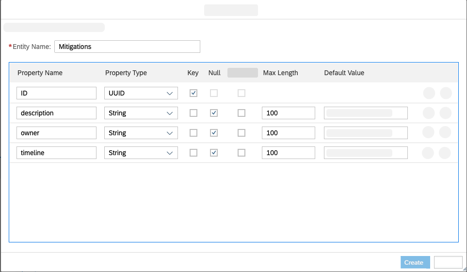

5. Choose **Create** to finish.

6. Now, you can see two properties in the **Data Model Editor**. Find the entry of **Risks** and click on the header of the table. Choose **Add relationship Icon** in the menu appearing on the right. Connect the appeared line to Mitigations entity, by clicking on table and configure the relationship in pop-up.

   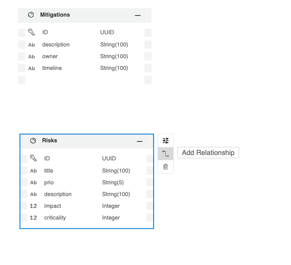

7. In the pop-up screen enter all the required details:
   - Select **Relationship:** _Association_
   - Select **Relationship Type:** _To-one_
   - Enter **Property name:** _miti_
   - Select **Target entity type:** _Riskmanagement.Mitigations_

8. Choose **Create**.

   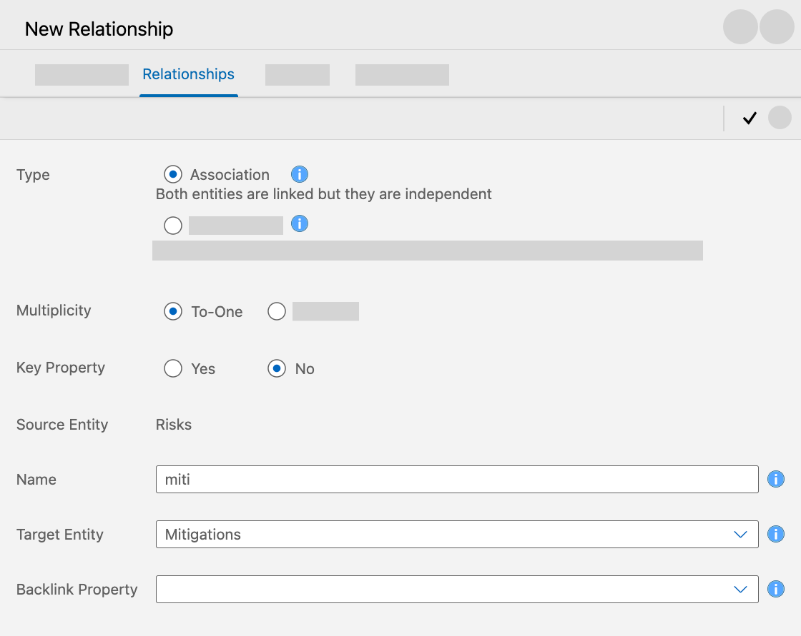

9. Repeat the step for **Mitigations** and click on the header of the table to **add relationship**. Connect the appeared line to Risks entity, by clicking on table and configure the relationship in pop-up.

10. In the pop-up screen select all the required details:
    - **Relationship:** Association
   - **Relationship type:** To-many
   - **Property Name:** risks
   - **Target Entity Type:** Riskmanagement.Risks
   - **Backlink Property:** miti

11. Choose **Create**.

    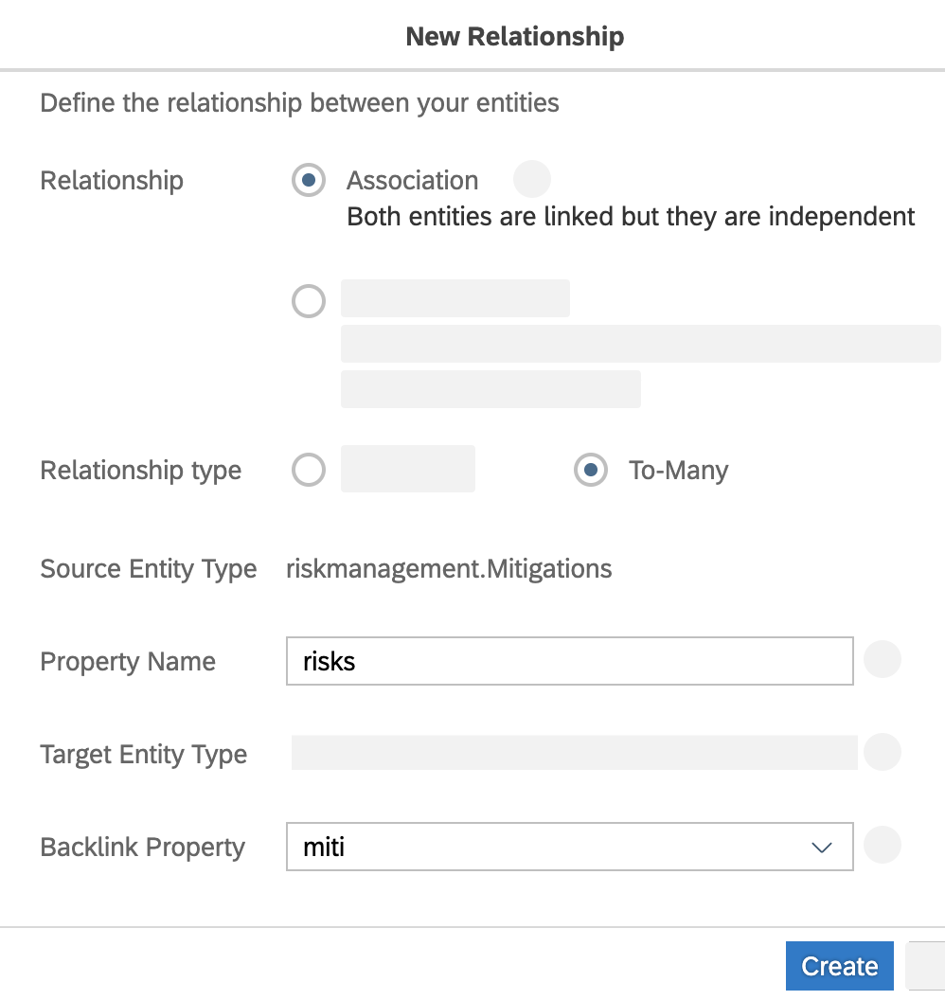

12. Back in the **Data Model Editor**, choose **Import** at the top bar.

13. In the dropdown, select **Common Types** from the list.

    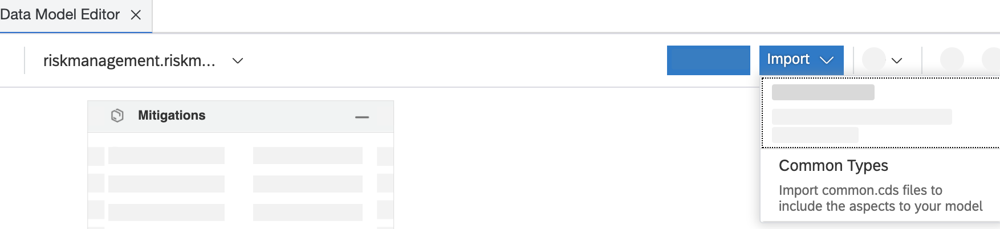

14. In the pop-up, select **managed** from the list and choose **Select** to finish.

    

15. Navigate back to the **Data Model Editor** and click on the header of the **Risks** entry and then choose the **Include Aspects** icon in the appeared menu.

    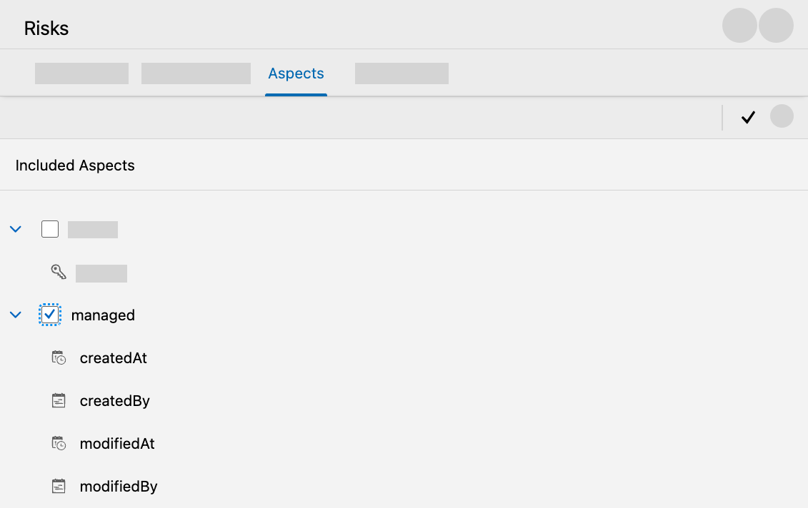

16. In the pop-up, choose **global.managed** from the list and choose **Select**.

    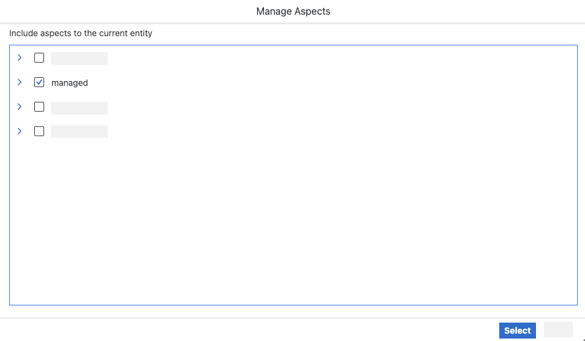

17. Repeat the steps for _Mitigations_. Click on the header of the **Mitigations** entry and choose the **Include Aspects** icon in the appeared menu.

18. In the pop-up, choose **global.managed** from the list and choose **Select**.

#### Create Services

1. Go back to the home page of the application. Find the **Services** tile and choose the **+** icon to add a new service entity.

   

2. On the next screen, enter the following and choose **Create** to finish:
   - Enter **Name:** _risks_
   - Select **Namespace:** _riskmanagementService_
   - Select **Type:** _Riskmanagement.Risks_

   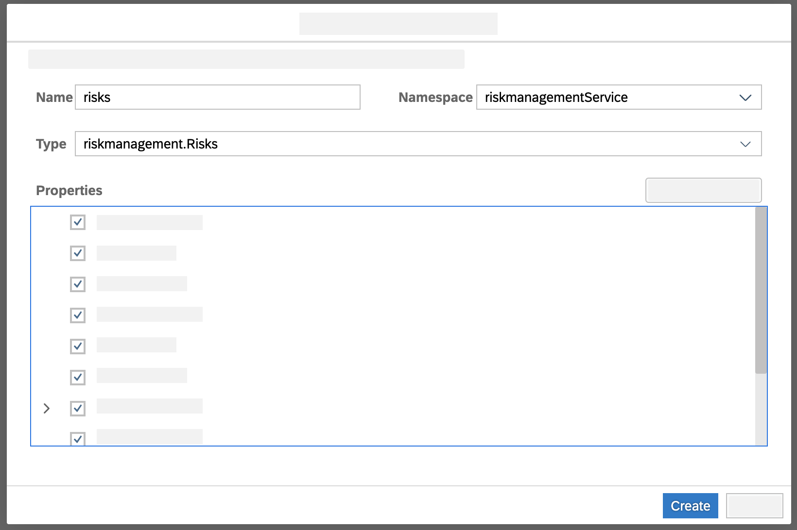

3. In the screen **Service Editor**, find the risks entity and choose header of entry. A menu will appear on the right side of the screen. in section **Property Sheet** check the checkbox for _draft editing_.

   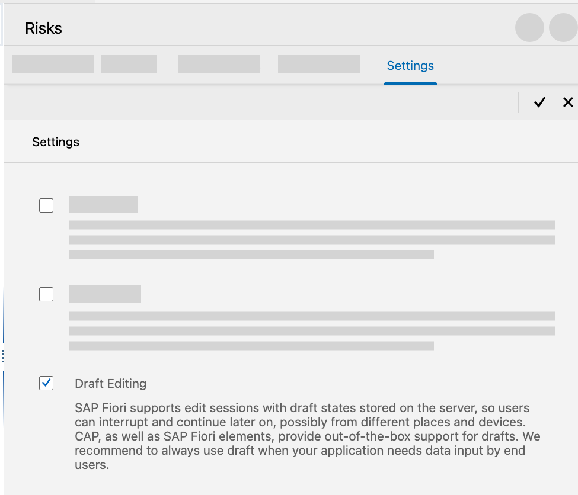

4. Back in **Service Editor** choose **Add Entity**. Repeat the previous steps and configure the new entity and choose **Create** to finish:
   - Enter **Name:** _mitigation_
   - Select **Namespace:** _'riskmanagementService_
   - Select **Type:** _Riskmanagement.Mitigation_

     

5. Find the Mitigations entity and choose header of entry. A menu will appear on the right side of the screen. In section **Property Sheet**, check the checkbox for _draft editing_.

#### Add Sample Data

Once the structure of your application is finished, you can add sample data to the application. You either can use the visual data editor or insert data using a CSV file.

1. Go back to the home page of the application. Find the **Sample Data** tile and choose **+** icon to add a new data entity.

   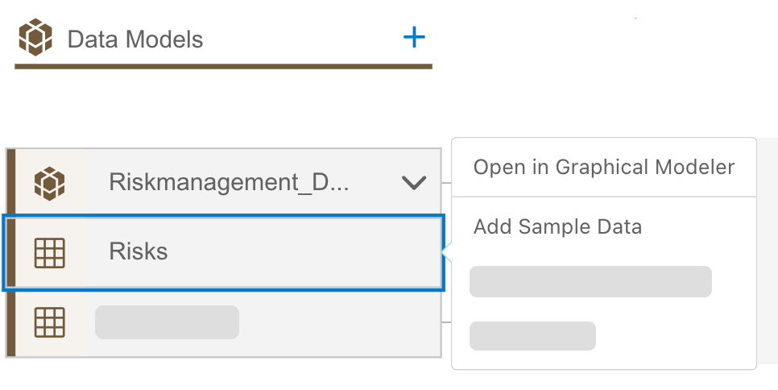

2. In the pop-up choose **Import** and select _Risks_ in the **Import for Entity** field. Then choose **Import**.

   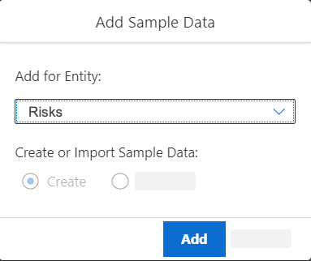

3. Import a CSV file with the required data for risks. You can download the `Riskmanagement-Risks.csv` file in [sample GitHub](../../../db/data/Riskmanagement-Risks.csv)

   

4. Repeat the steps 1–3 with _Mitigations_. Find the example `Riskmanagement-Mitigations.csv` file in [sample GitHub](../../../db/data/Riskmanagement-Mitigations.csv)

#### Add User Interface

After defining the foundation of your application, we will add an SAP Fiori elements based User Interface to the application.

Last step in development is creating a user interface for the application.

1. Go back to the home page and find the **User Interface** tile and choose the **+** icon to add a new user interface.

   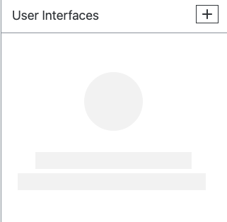

2. A screen will show up where you can add the **Application Name**: _Risks_ and enter a description. Choose **Next**.

   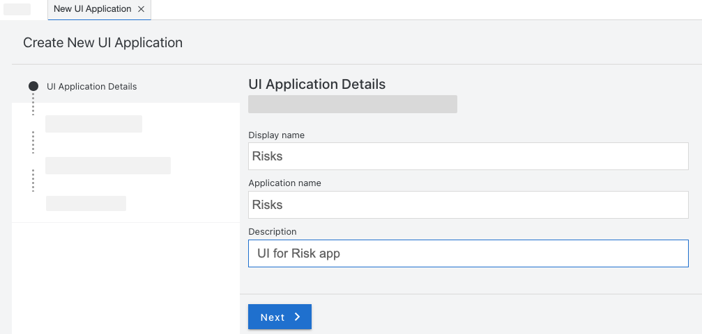

3. Select **UI Application type** as _Template-Based, Responsive Application_ to create a SAP Fiori elements based UI. Choose **Next**.

   

4. Choose **UI application template** as _list report object page_. Choose **Next**.

   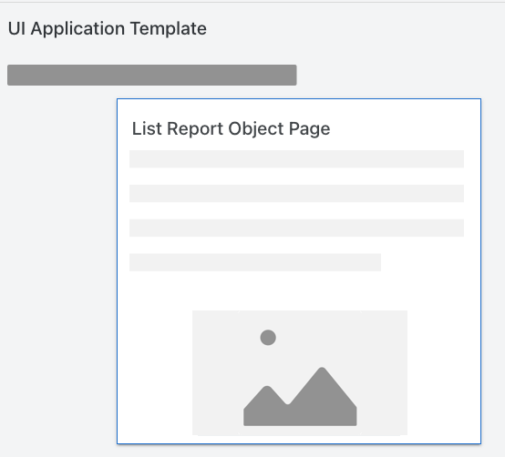

5. Select main entity _risks_ in main entity, to show risks entity in UI. Choose **Finish**.

   

6. Repeat the steps 1–4 for _Mitigations_.

7. Select main entity _mitigation_ in main entity, to show mitigations entity in the UI and choose _risks_ as navigation entity. Choose **Finish**.

#### Create User Roles

Now, you can create roles to define different authorization for your application. For example you might want to ensure that some people can view data, but are not able to edit them.

1. Go back to the home page of the application. Find the **User Roles** tile and choose the **+** icon to add a new role.

   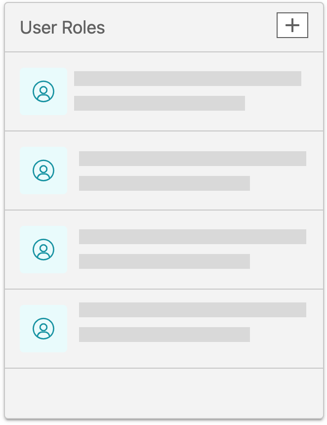

2. Choose the **+** icon to add new user role and enter a role name, for example, _RiskViewer_. Enter a description and choose **Read** as **Privilege Defaults**. Choose **Save**.

   

3. Choose your created role and select your created service in the **Service Assignments** field. Choose **Add Service Entities**.

   

4. In the pop-up, switch on the assign toggle button for _risks_ and _mitigations_. Check if slider for privileges is selected as read. Choose **Save**.

   

5. Go back to **User Roles** and choose the **+** icon to add a new role. Enter a role name, for example, _RiskManager'_. Enter a description and choose **Full** as Privilege Defaults. Choose **Save**.

   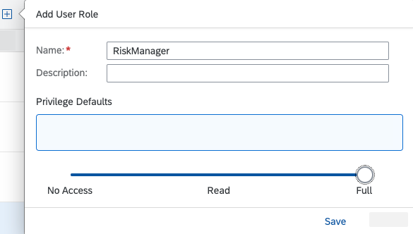

6. Choose your created role and select your created service in the **Service Assignments** field. Choose **Add Service Entities**.

7. In the pop-up, switch on the assign toggle button for _risks_ and _mitigations_. Check if slider for privileges is selected as full. Choose **Save**.

   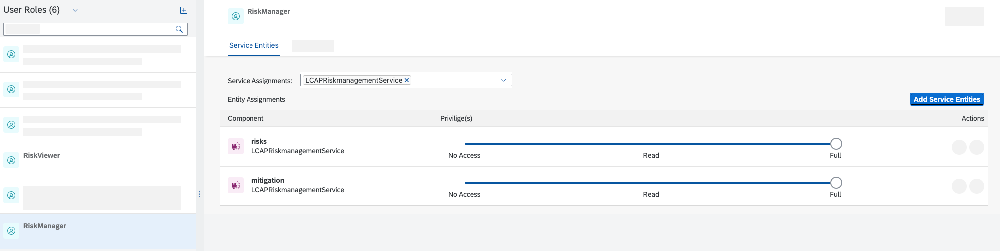

## Summary

Congratulations! You now have finished a first version of your application. In this section you have created data models to hold the data, defined relationships between the entities and uploaded some first test data. In addition, you have build a user interface to display this data. As last step you have added a role concept to define different authorization. Next you will test the application.

Need help? Look at the [Troubleshooting Guide](../../complete/troubleshooting#develop-risk-management-application-using-sap-business-application-studio-visual-tools) or use mission support to connect with mission experts.
