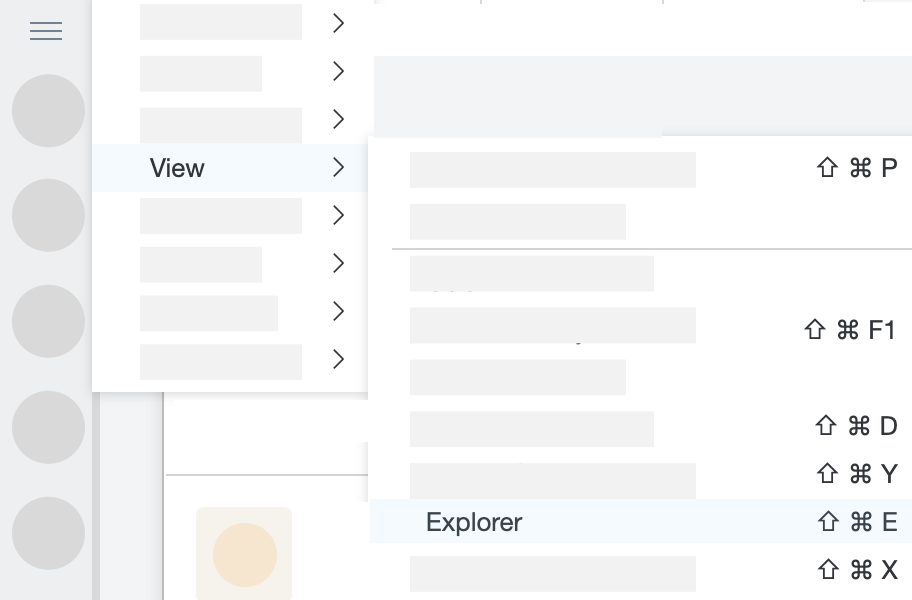
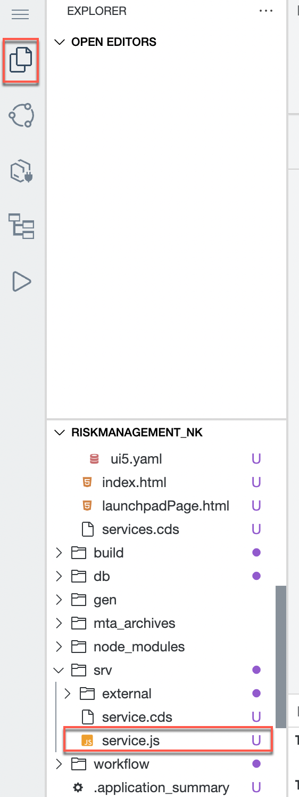
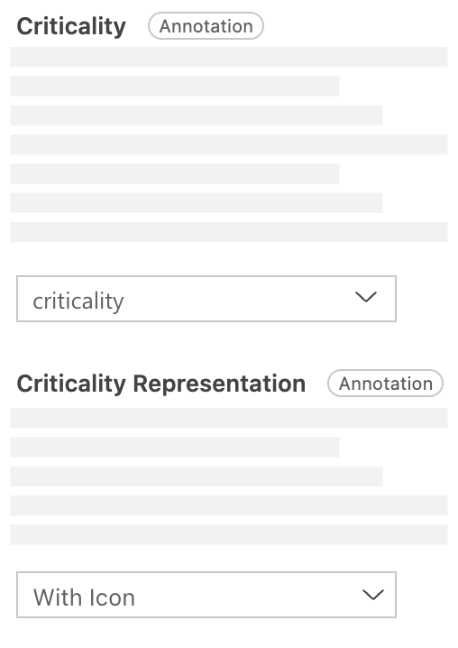
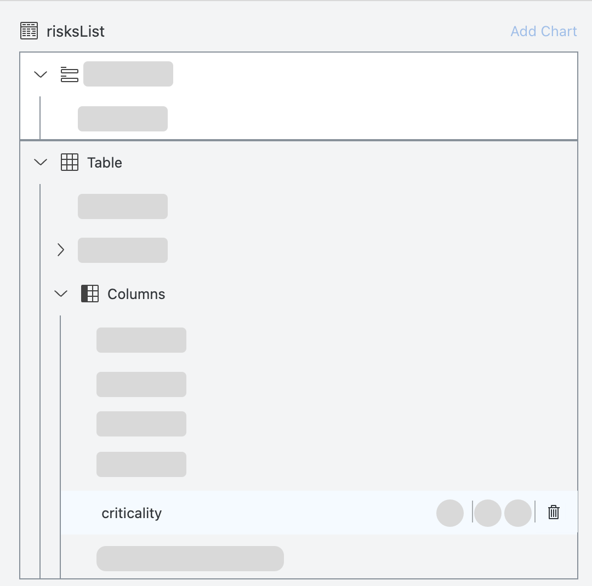
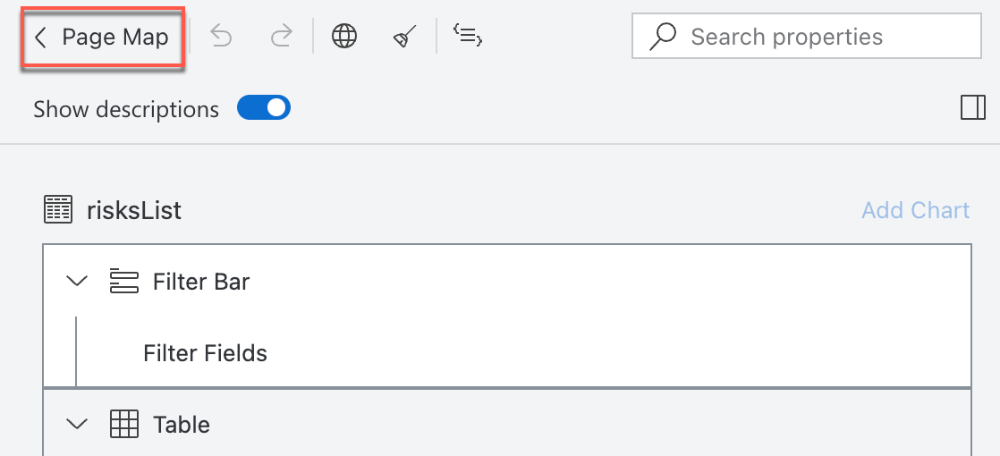
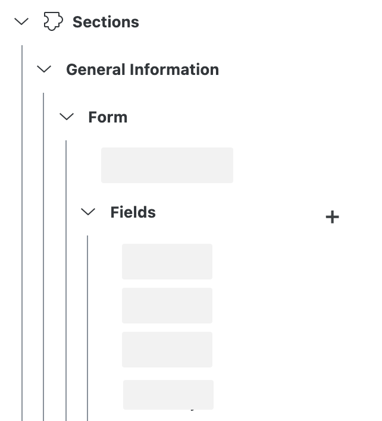

# Implement Custom Logic

## Introduction

In this section, you will implement the custom logic to define the criticality based on the impact of the risks

- Create service implementation file
- Add 'READ' service handler for the `risks` entity
- Implement the custom logic
- Modify the User interface `Risk` app with necessary changes

### Create service implementation file

1. Enable explorer if not already done. Click the hamburger icon in the top left corner and choose View -> Explorer

    

This gives us the possiblity to explore the files generated by the Low-code application tools.

2. Create a new file `srv/service.js`
    

3. Add the following code to the file

```js
module.exports = async (srv) => {

    srv.after('READ', 'risks', (risksData) => {

        const risks = Array.isArray(risksData) ? risksData : [risksData];
        risks.forEach(risk => {
            if (risk.impact >= 100000) {
                risk.criticality = 1;
            } else {
                risk.criticality = 2;
            }
        });
    });

};
```

### Update UI Components

1. Navigate to the **Home** page of SAP Business Application Studio.

2. Find the tile **User Interfaces** and choose the entry **Risks**.

3. Find the entry **List Report** and choose the icon to edit.

    

4. In the Page Editor, expand the **Columns** section and choose `impact`

5. Find the entry **Criticality** and choose `criticality` column as the value

6. Also choose **Criticality Representation** as _With Icon_

     

7. Now, we no longer require the seperate `criticality` column. Find and remove the `criticality` column by clicking delete icon next to it. 

    

8. Click on the arrow to navigate back

    

9. choose **risks** to open the **Object Page** entry and choose the edit icon.

    

10. In the entry Section open **General Information → Form → Fields**.

    

11. Find and remove the `criticality` column by clicking delete icon next to it. 

## Summary

You now have added the custom logic and handler to the developed application.

You can now perform a quick test run using the [preview](https://help.sap.com/docs/Application%20Development/6a5fc562f6e2402aa84b0416614a05fc/d0d7f68abdcb4c4bb9df427c9f925dba.html?locale=en-US) in SAP Business Application Studio with sample data to try out the application.
> Hint: In case there is no Preview button in Home screen, select the **...** button and then choose **Preview** in the dropdown
