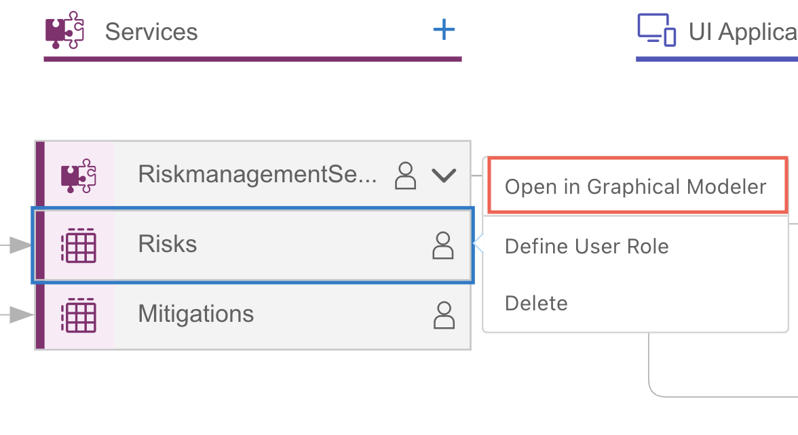
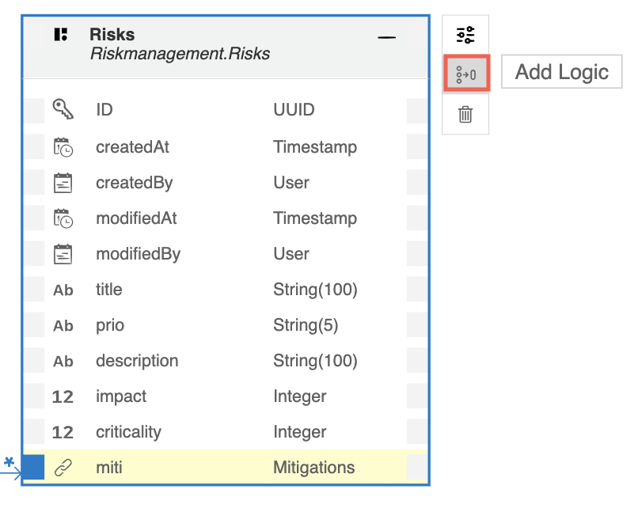
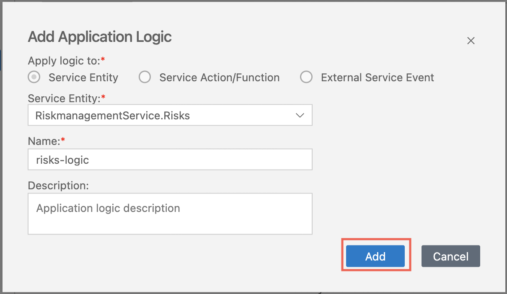
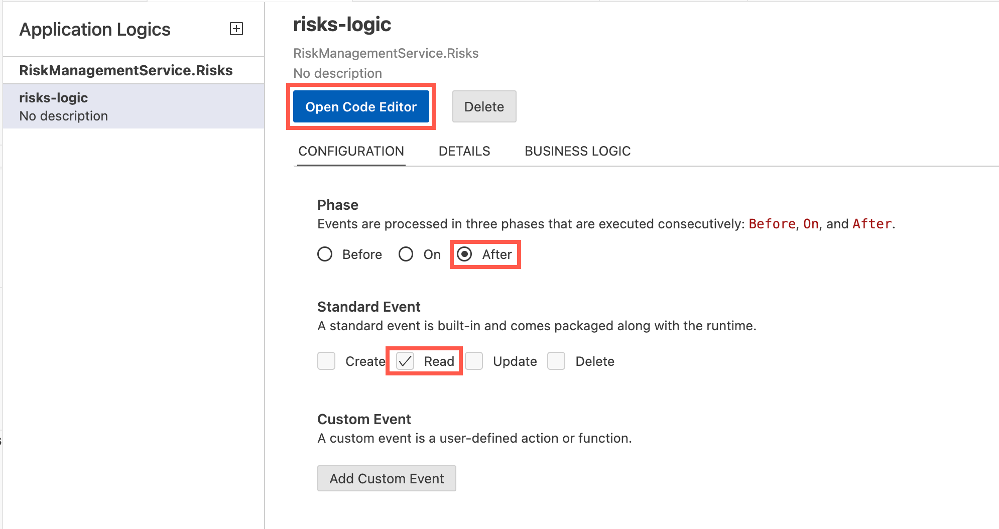
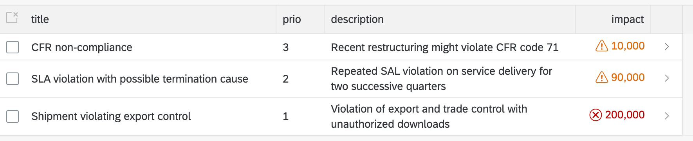

# Implement Custom Logic

## Introduction

In this section, you will implement the custom logic to define the criticality based on the impact of the risks.

- Create service implementation 
- Add 'READ' service handler for the `risks` entity
- Implement the custom logic
- Modify the user interface `Risk` app with necessary changes

### Create Service Implementation 

1. Under the **Storyboard** tab, choose **Risks** under _Services_ tile and choose **open in Graphical Modeler** to create the Business Logic.

    

2. Choose the **Add Logic** in the storyboard and then choose the **Add** button in Add application logic popup.

    

    

3. Now Select **After** in the Phase, **Read** in the Standard Event and choose the **Open Code Editor**.

        

4. Add the following code to the `code/risks-service.js` under the **module.exports**:

```js

            const risksData = results;
            const risks = Array.isArray(risksData) ? risksData : [risksData];
            risks.forEach(risk => {
                if (risk.impact >= 100000) {
                    risk.criticality = 1;
                } else {
                    risk.criticality = 2;
                }
            });
```
>Hint: Files are auto saved, this might take a few seconds.

### Update UI Components

1. Navigate to the **Storyboard** tab of the project.

2. Find the tile **UI Applications** and choose the entry **Risks** and choose **Open in Page Map**.

3. Find the entry **List Report** and choose the icon to edit.

    

4. In the Page Editor, expand the **Columns** section and choose **impact**.

5. Find the entry **Criticality** and choose **criticality** column as the value.

6. Choose **Criticality Representation** as **With Icon**.

     

7. Now, the separate _criticality_ column is no longer required. Find and remove the _criticality_ column by by clicking the delete icon next to it. 

    

8. Click on the Page Map arrow to navigate back.

    

9. Choose the **Object Page** entry and choose the edit icon.

    

10. In the entry section open **General Information &rarr; Form &rarr; Fields**.

    

11. Find and remove the _criticality_ column by clicking the delete icon next to it. 

## Summary

You now have added the custom logic and handler to the developed application.

You can now perform a quick test run using the **[Run and Debug](https://help.sap.com/docs/bas/developing-business-applications-using-productivity-tools/testing-applications?q=run%20and%20debug)** button in the top right of your screen. in SAP Business Application Studio with sample data to try out the application.


> Hint: Notice the change in the _impact_ column.


