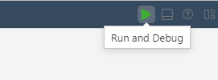
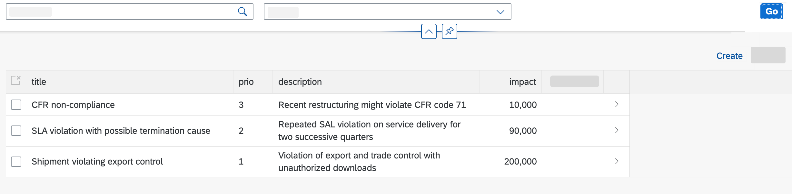
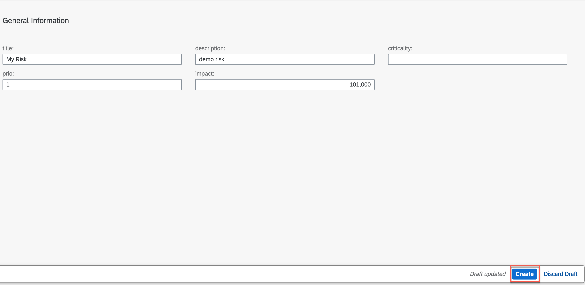

# Test Application with Sample Data

## Introduction

Congratulations! You now have finished a first version of your application. In this section, you will perform a quick test run using the [preview](https://help.sap.com/docs/Application%20Development/6a5fc562f6e2402aa84b0416614a05fc/d0d7f68abdcb4c4bb9df427c9f925dba.html?locale=en-US) in SAP Business Application Studio with sample data to try out the application.

## Preview SAP BTP Application

1. Make sure you have opened **SAP Business Application Studio** and navigate to the **Storyboard**.

2. Choose the **[Run and Debug](https://help.sap.com/docs/bas/developing-business-applications-using-productivity-tools/testing-applications?q=run%20and%20debug)** button in the top right of your screen.

   

3. A new browser tab will open showing your application.

4. Choose a tile to try out your app.

   

5. Click on `Risk` app

6. Click `Go` button to display the sample data

   

7. Click on `create` button to create a new Risk

8. Enter the details for title, description, prio and impact

      

9. Click on `create` button

10. Make sure you exit the preview mode after your test is finished by clicking **Stop Preview** in SAP BAS.
