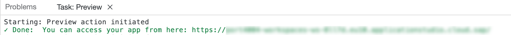

# Test Application with Sample Data

## Introduction

Congratulations! You now have finished a first version of your application. In this section, you will perform a quick test run using the [preview](https://help.sap.com/docs/Application%20Development/6a5fc562f6e2402aa84b0416614a05fc/d0d7f68abdcb4c4bb9df427c9f925dba.html?locale=en-US) in SAP Business Application Studio with sample data to try out the application.

## Preview SAP BTP Application

1. Make sure you have opened **SAP Business Application Studio** and navigate to the **Home** tab.

2. Find the **[Preview](https://help.sap.com/docs/Application%20Development/6a5fc562f6e2402aa84b0416614a05fc/d0d7f68abdcb4c4bb9df427c9f925dba.html?locale=en-US)** button in the top right of your screen.

3. In the dropdown, choose **With Sample Data**.

   

4. If the new tab doesn't automatically open, and the below popup appears on the screen, click the open button.

   

4. If the new tab doesn't automatically open, find the link to your test application in the terminal and click to open.

   

5. Choose a tile to try out your app.

   

6. Make sure you exit the preview mode after your test is finished by clicking **Stop Preview** in SAP BAS.
