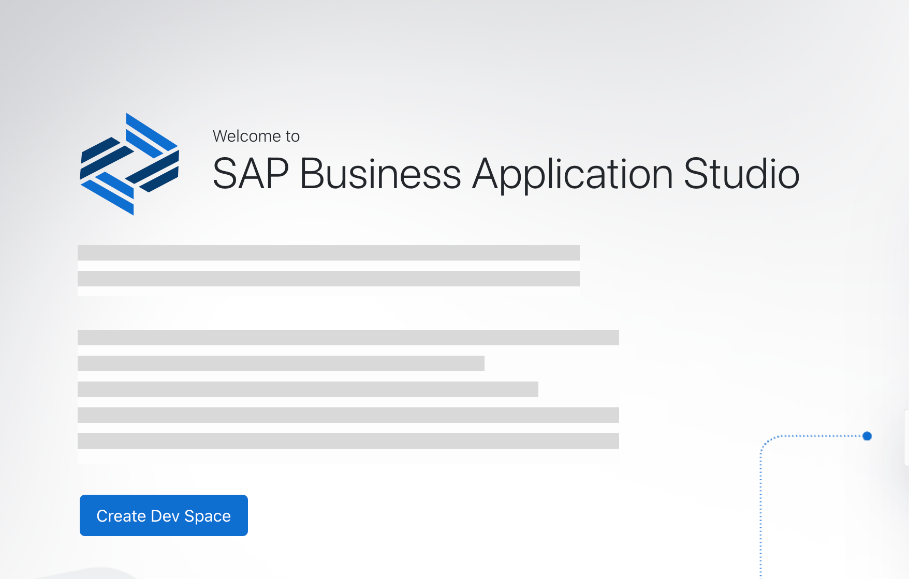
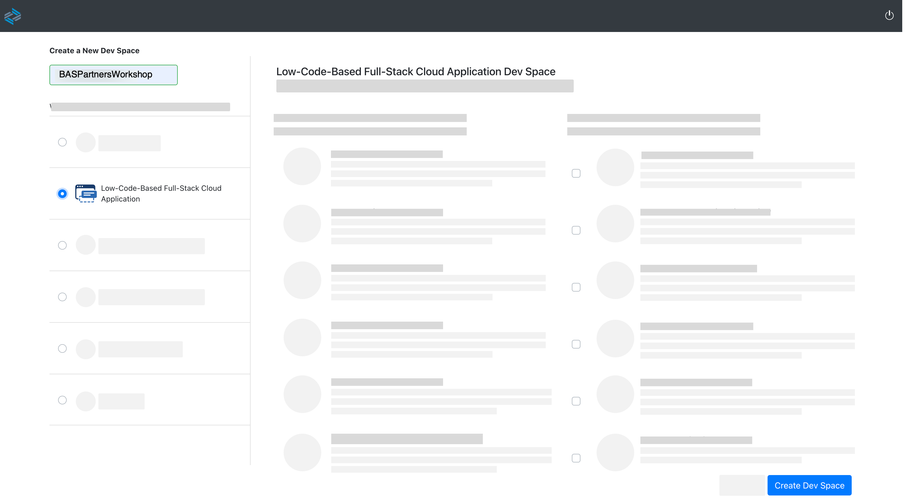
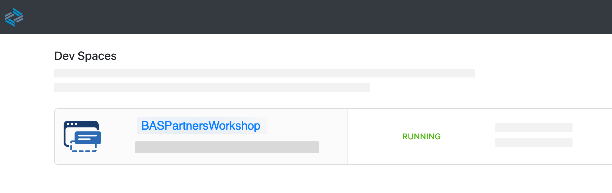

# Prerequisites

## Introduction

In this section you will first create your development environment in SAP Business Application Studio. Then you will use the created environment to develop the sample application in next chapter.

### Configure Business Application Studio Workspace

1. Go to your subaccount in SAP BTP Cockpit and navigate to **Instances and Subscriptions** in the menu on the left side of the screen.

2. Find **SAP Business Application Studio** in the application section and choose the browser icon to open the app.

3. In home page of SAP Business Application Studio choose button **Create Dev Space** to start

   

   > A [dev space](https://help.sap.com/docs/SAP%20Business%20Application%20Studio/9d1db9835307451daa8c930fbd9ab264/6053df8bca3946f098bc9f89e49d7317.html?locale=en-US) in SAP Business Application Studio is a development environment with the tools, capabilities, and resources needed for developing your application.

4. Enter a name for your Dev Space for example, _Riskmanagement_  and select **[Low-Code-Based Full-Stack Cloud Application](https://help.sap.com/docs/SAP%20Business%20Application%20Studio/9d1db9835307451daa8c930fbd9ab264/00ad0484344c461caf80a7c695fd38af.html?locale=en-US)** in menu.

5. Choose **Create Dev Space**

   

6. Your Dev Space is now being created and as soon as status change to _Running_ you can open your Dev Space by clicking on the name

   

## Summary

You now have created the dev space in SAP Business Application Studio. In the next chapter you will develop the sample application using SAP Business Application studio visual tools.