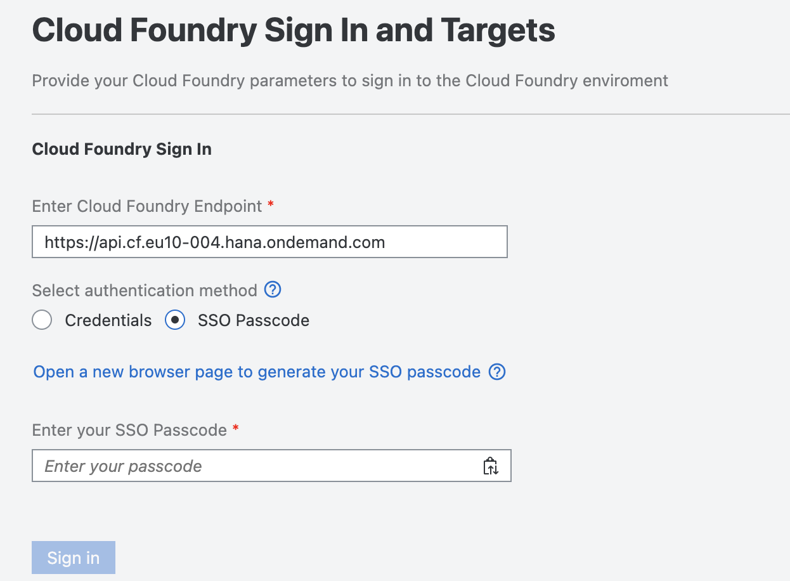
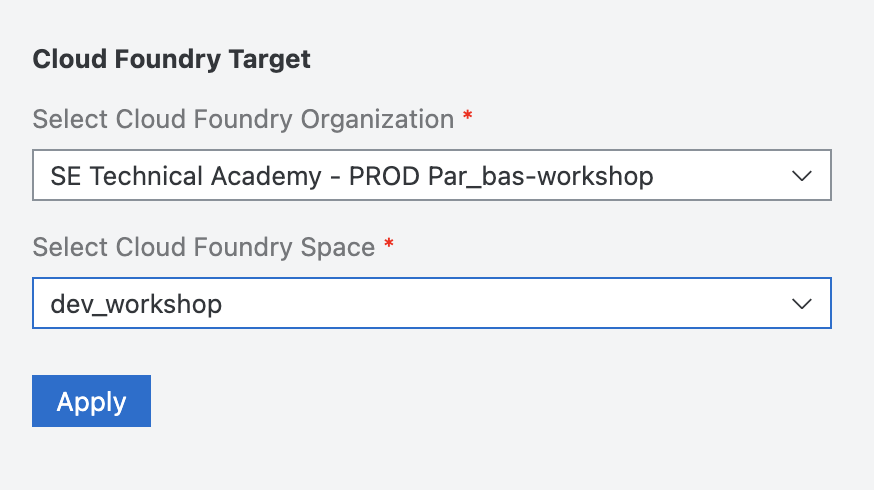
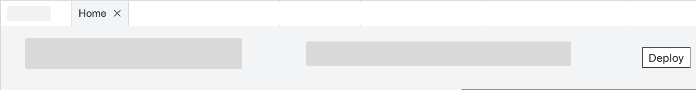
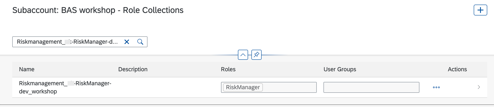
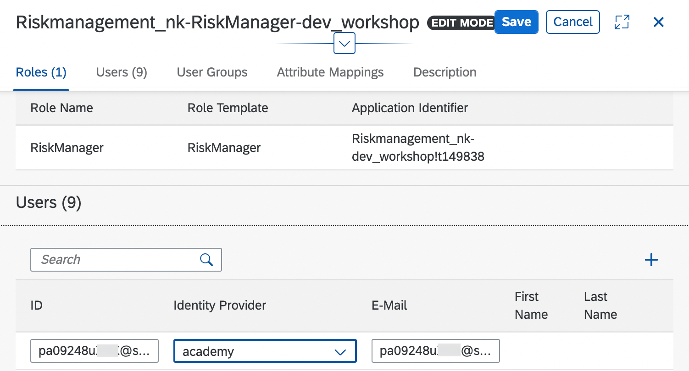
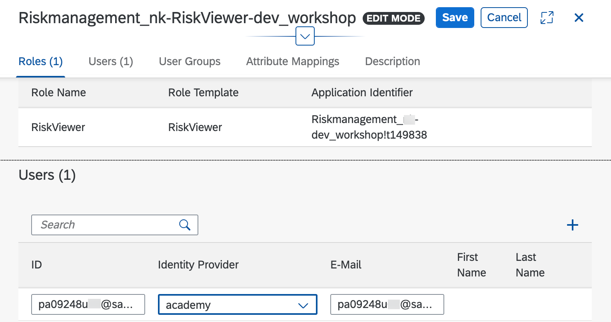

# Deploy Application to Cloud Foundry Environment

## Introduction

In this section, you will deploy the application to Cloud Foundry environment.

 

### Deploy Application to Cloud Foundry

1. Open SAP Business Application Studio.

2. Log in to your account:
   - Click the Hamburger icon and choose **View** then **Find Command**
   - Select `CF: Login to Cloud Foundary`
   - Provide API endpoint to your account - https://api.cf.eu10-004.hana.ondemand.com
   - Select authentication method 'SSO Passcode'
   - Click on the link 'open a new browser page to generate your SSO passcode'
   - Enter SSO passcode 
   - Click on Sign in

   
   
   - Select org and space

      - Organization: `SE Technical Academy - PROD par_bas-workshop`
      - Space: `dev_workshop`
   - Click on Apply
   
   

3. Find the **Deploy** button in the top right of Home Page.

      

4. Your application will be deployed. This can take a few minutes.

### Assign Role Collection

Before you can use the application, you need to assign yourself to the roles you have created in the section before. This needs to be done so you are able to edit and view the data from the application.

1. Go back to [SAP BTP Cockpit](https://cockpit.eu10.hana.ondemand.com/cockpit/?idp=academy.accounts.ondemand.com#/globalaccount/3244cb28-faa5-4976-8e20-7bc51609e836/subaccount/ff389d21-d298-447b-8744-5152be1ed0cb/rolecollections).

2. Navigate to **Security** &rarr; **Role Collections**.

3. Search for Role collection `<project name>_RiskManager-dev_workshop`
>Hint: Replace project name, For example Riskmanagement_sap_RiskManager-dev_workshop

   

4. Enter the role collection and click on `Edit`

5. Under `users` add your user information

- Identity Provider: **academy**
- UserId: pa09248uXXX@sapexperienceacademy.com
- E-Mail: pa09248uXXX@sapexperienceacademy.com

>Hint: Replace XXX with provided userId. For example, pa09248u100@sapexperienceacademy.com in lowercase

   

6. Click on save

7. Similarly, search for Role Collection `<project name>_RiskViewer-dev_workshop`
>Hint: Replace project name, For example Riskmanagement_sap_RiskViewer-dev_workshop

8. Enter the role collection and click on `Edit`

9. Under `users` add your user information

- Identity Provider: **academy**
- UserId: pa09248uXXX@sapexperienceacademy.com
- E-Mail: pa09248uXXX@sapexperienceacademy.com

>Hint: Replace XXX with provided userId. For example, pa09248u100@sapexperienceacademy.com in lowercase

   

10. Click on save
