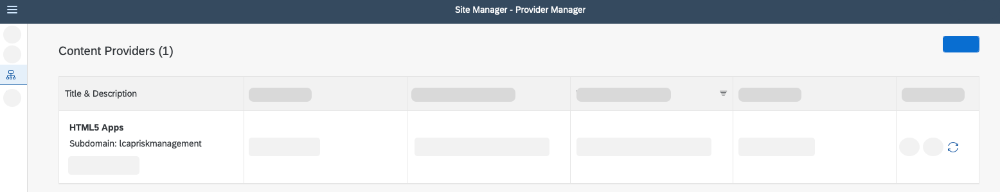
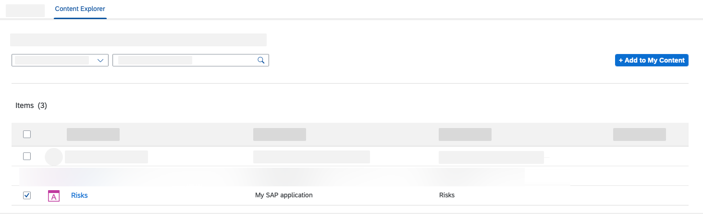
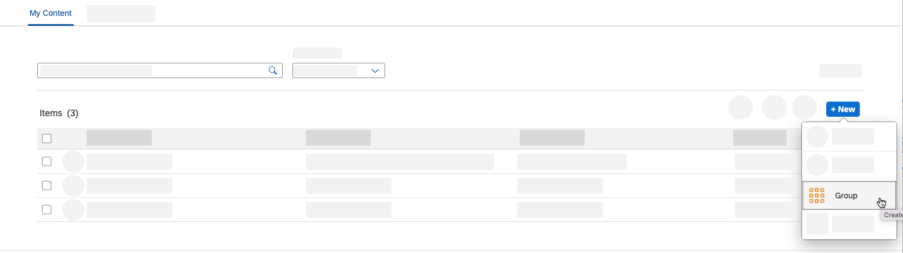
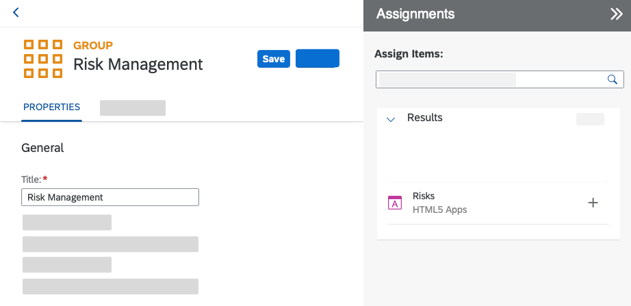
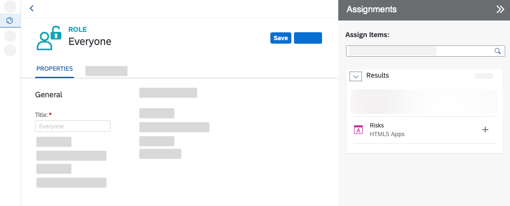
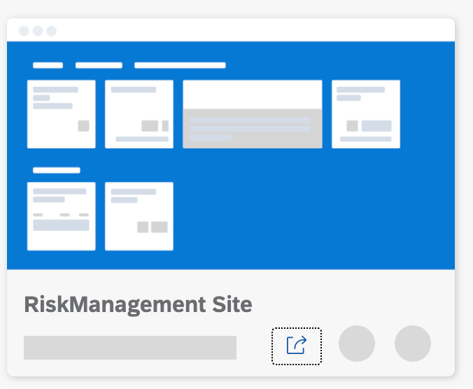
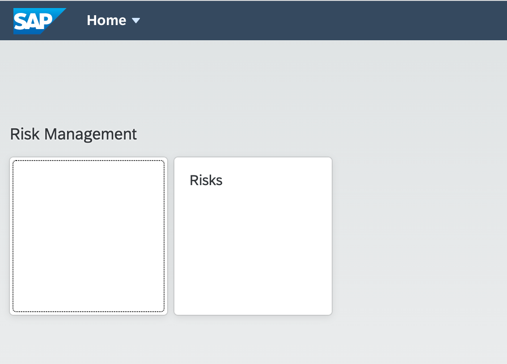
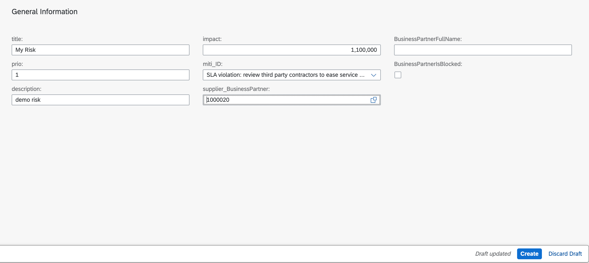

# Integrate the Application with SAP Launchpad Service

## Introduction

In this section, the application will be connected with SAP Launchpad service. This allows to have one central entry point to show all of your SAP BTP applications.

 

###  Integrate with Launchpad Service

1. Open [Launchpad Service](https://bas-workshop.dt.launchpad.cfapps.eu10.hana.ondemand.com/) and login with the provided user-id and password.

2. In the menu on the left side choose the icon for **Provider Manager**.

3. Choose the refresh icon to fetch the updated content.

    

4. Choose **Content Manager** in the menu on the left and open tab **Content Explorer**.

5. Select the tile _HTML5 Apps_ with your respective subdomain name.

    

6. In the items table, set checkmark for the apps **Risks** and **Mitigations** and choose the button **Add to My Content**.

    

7. Go to the **My Content** tab, choose **New** and select **Group** from dropdown.

    

8. Add the title _RiskManagement_sap_ (replace `sap` with unique identifier)

9. Assign items on the right section of your screen. Search for **Risks** and **Mitigations** and choose the '+' icon to assign the apps.

10. Choose **Save**.

    

11. Back in the **Content Manager**, choose role **Everyone** and **Edit**.

12. Assign items on the right section of your screen. Search for **Risks** and **Mitigations** and choose the '+' icon to assign the apps.

13. Choose **Save**.

    

14. In the menu on the left side navigate to **Site Directory**.

15. Choose button **Create Site**.

    

16. Enter the site name as 'RiskManagement Site < uniqueName >' and choose **Create**.

17. Now, you are forwarded to your created site. Choose **Edit**.

18. Navigate to **Site Directory**.

19. Find your created site and open it by choosing **Go to site**.

    

#### Test the Application

1. Open the Risks Application

     

    

2. Create New Risk

- Choose Create button
- Provide values in title, impact, prio, description.

    

- Choose value help icon to select supplier_BusinessPartner

- Choose mitigation

3. Choose create button to generate new Risk  

 ## Summary

 Congratulations! You now have finished the development of your application. In this last step you have integrated SAP Launchpad service, to have one central entry point to show all of your SAP BTP applications.
